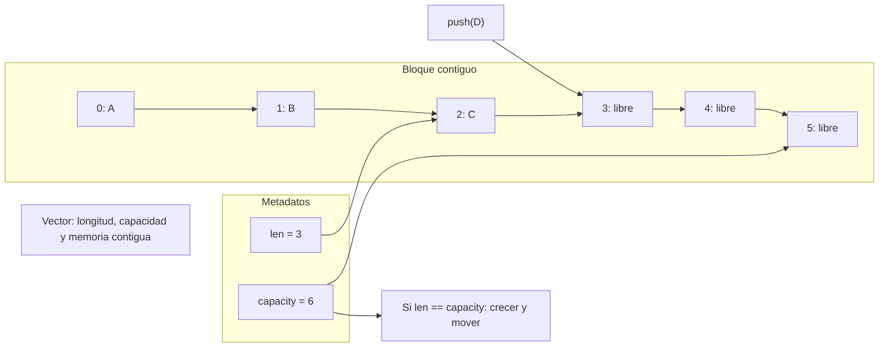

# Vector

> **Curso:** rust-data-structures · **Capítulo:** 01 · **Prerequisitos:** ninguno
> **Código:** [`src/vector.rs`](../src/vector.rs) · **Video:** pendiente
> **Lección en el sitio:** pendiente

## Introducción

Un vector es un arreglo dinamico: una secuencia de elementos guardados en memoria
contigua, con una longitud visible y una capacidad reservada. Es la primera
estructura del curso porque obliga a entender tres ideas que regresan todo el
tiempo: representacion interna, invariantes y costo real de una operacion.

En este capitulo se asume que ya puedes leer Rust basico: `struct`, `impl`,
genericos, `Option`, ownership y referencias. No se asume experiencia con
gestion manual de memoria; precisamente por eso esta implementacion usa Rust
seguro y deja la version con memoria sin inicializar como comparacion
conceptual.

## Motivación

Imagina un motor de busqueda de reservas que recibe habitaciones candidatas. No
sabe de antemano si encontrara dos, veinte o doscientas habitaciones, pero si
necesita conservarlas en orden para filtrarlas, ordenarlas y mostrar resultados.
Un arreglo de tamano fijo obliga a escoger una capacidad antes de conocer los
datos. Una lista enlazada evita ese limite, pero paga con peor localidad de
memoria y acceso por indice costoso.

El vector resuelve el punto medio: guarda elementos contiguos como un arreglo,
pero crece cuando se llena. Esa decision explica casi todo el capitulo: el
acceso por indice es barato porque la memoria es contigua; `push` suele ser
barato porque normalmente hay capacidad libre; insertar al frente es caro porque
hay que mover los elementos.

## Teoría

### Historia

Los arreglos dinamicos aparecen como respuesta practica a una limitacion muy
antigua: muchos programas necesitan colecciones secuenciales cuyo tamano se
descubre durante la ejecucion. Lenguajes y bibliotecas los han nombrado de
formas distintas: `vector` en C++, `ArrayList` en Java, `list` en Python y
`Vec<T>` en Rust.

La idea central no cambia: reservar un bloque contiguo, recordar cuantos
elementos estan inicializados y crecer a un bloque mayor cuando la longitud
alcanza la capacidad. La tecnica es sencilla, pero poderosa: convierte muchas
inserciones al final en tiempo amortizado constante.

### Fundamentos

Nuestro `Vector<T>` mantiene dos campos:

- `items`: bloque contiguo de ranuras.
- `len`: numero de elementos vivos.

La capacidad es `items.len()`. La invariante principal es:

```text
0 <= len <= capacity
```

Ademas, en esta implementacion segura, todas las posiciones `0..len` contienen
`Some(T)` y todas las posiciones que quedan fuera de la longitud se tratan como
espacio libre. Usamos `Option<T>` para que Rust pueda saber que ranuras tienen
valor inicializado sin escribir `unsafe`.

Cuando `push` encuentra espacio libre, escribe en `items[len]` y aumenta `len`.
Cuando no hay espacio, `grow` reserva un bloque nuevo, normalmente del doble de
capacidad, mueve los elementos y luego inserta el valor. Ese crecimiento ocasional
es lo que hace que `push` tenga costo O(1) amortizado: algunas operaciones cuestan
O(n), pero repartidas sobre muchas inserciones el costo promedio por `push` es
constante.

### Casos de uso

Los vectores aparecen en casi todos los sistemas:

- Resultados de busqueda antes de paginar o ordenar.
- Buffers de eventos recibidos en lote.
- Listas de IDs para filtrar entidades.
- Tablas densas donde el indice es significativo.
- Fronteras temporales en algoritmos, cuando no se necesita remover al frente.

Tambien son la base de muchas estructuras futuras. Un heap binario suele
representarse con un vector. Una cola circular puede usar un bloque contiguo.
Muchas implementaciones de grafos usan vectores de listas de adyacencia.

### Ventajas y limitaciones

Ventajas:

- Acceso por indice O(1).
- Muy buena localidad de cache por memoria contigua.
- Iteracion simple y rapida.
- `push` al final O(1) amortizado.
- Representacion facil de inspeccionar y probar.

Limitaciones:

- Insertar o remover al principio cuesta O(n).
- Crecer puede mover todos los elementos.
- La capacidad puede reservar memoria que aun no se usa.
- Mantener punteros o referencias a elementos es delicado si el vector crece.
- Nuestra version segura con `Option<T>` es pedagogica, no la mas eficiente.

### Comparación con alternativas

Un arreglo fijo es mejor cuando el tamano se conoce y no cambia. Un slice es una
vista prestada sobre memoria existente, no una coleccion que crece. Una lista
enlazada evita mover muchos elementos al insertar cerca del inicio, pero pierde
localidad y acceso por indice barato. Un deque es mejor cuando se necesita
insertar y remover por ambos extremos.

El vector es la opcion correcta cuando el caso comun es agregar al final,
recorrer en orden o acceder por indice. No es buena opcion cuando la operacion
dominante es insertar al frente o remover constantemente del inicio.

## Diagramas

El diagrama principal vive en [`diagrams/01-vector.mmd`](../diagrams/01-vector.mmd).



## Análisis de complejidad

| Operación | Mejor caso | Caso promedio | Peor caso | Espacio |
|-----------|------------|---------------|-----------|---------|
| `new` | O(1) | O(1) | O(1) | O(1) |
| `with_capacity(n)` | O(n) | O(n) | O(n) | O(n) |
| `len` / `capacity` / `is_empty` | O(1) | O(1) | O(1) | O(1) |
| `get` / `get_mut` | O(1) | O(1) | O(1) | O(1) |
| `push` | O(1) | O(1) amortizado | O(n) | O(n) si crece |
| `pop` | O(1) | O(1) | O(1) | O(1) |
| `insert` | O(1) al final con espacio | O(n) | O(n) | O(n) si crece |
| `remove` | O(1) al final | O(n) | O(n) | O(1) |
| `clear` | O(n) | O(n) | O(n) | O(1) |
| `iter` | O(1) crear, O(n) consumir | O(n) | O(n) | O(1) |

`with_capacity(n)` es O(n) en esta version porque inicializa `n` ranuras con
`None`. `Vec<T>` de la biblioteca estandar puede reservar memoria sin inicializar
con tecnicas internas que requieren invariantes mas finas.

La diferencia entre `push` e `insert(0, value)` es la leccion central. `push`
normalmente escribe al final. `insert(0, value)` debe desplazar todos los
elementos una posicion a la derecha.

## Visualización interactiva (opcional)

No aplica todavia. Este capitulo se entiende con el diagrama estatico y los
benchmarks; una visualizacion interactiva se agregara cuando `academy-web`
defina el mecanismo de playgrounds.

## Implementación

La implementacion completa vive en [`src/vector.rs`](../src/vector.rs).

La representacion es deliberadamente segura:

```rust
pub struct Vector<T> {
    items: Box<[Option<T>]>,
    len: usize,
}
```

`items` es el bloque contiguo. `len` separa las ranuras ocupadas de la capacidad
reservada. El costo educativo de usar `Option<T>` es que inicializamos ranuras
libres; el beneficio es que evitamos `unsafe` mientras estudiamos la estructura.

El crecimiento duplica capacidad:

```rust
let next_capacity = if self.capacity() == 0 {
    1
} else {
    self.capacity() * 2
};
```

Duplicar no es magia: es una estrategia para que el numero total de movimientos
tras muchas inserciones sea lineal, no cuadratico. Si crecieramos de uno en uno,
cada `push` al llenar capacidad moveria casi todo otra vez.

Insertar en medio muestra el costo que `push` esconde:

```rust
for current in (index..self.len).rev() {
    self.items[current + 1] = self.items[current].take();
}
```

Se recorre al reves para no sobrescribir valores que todavia deben moverse.
Remover hace lo contrario: toma el elemento y desplaza lo que esta a la derecha
una posicion a la izquierda.

## Pruebas

Las pruebas viven en [`tests/vector_test.rs`](../tests/vector_test.rs) y en el
modulo interno de [`src/vector.rs`](../src/vector.rs).

Cubren:

- Vector vacio: longitud, capacidad y `pop` sobre vacio.
- Crecimiento de capacidad.
- Acceso dentro y fuera de rango.
- Mutacion por indice con `get_mut`.
- Insercion al medio y al final.
- Remocion y preservacion de orden.
- Iteracion.
- `clear` conservando capacidad.
- Comportamiento de ownership: `remove` transfiere propiedad y `clear` destruye
  los valores restantes.

Los doc-comments tambien son pruebas: `cargo test --doc` compila y ejecuta los
ejemplos de la API publica.

## Benchmarks

El benchmark vive en [`benches/vector_bench.rs`](../benches/vector_bench.rs) y
se ejecuta con:

```bash
cargo bench --bench vector_bench
```

Mide cuatro caminos:

- crecimiento por `push`;
- acceso por indice;
- insercion al frente;
- insercion al final con `insert(len, value)`.

En una corrida local inicial con `SIZE = 20_000`, la insercion al frente fue
varios ordenes de magnitud mas lenta que `push` o acceso por indice. El numero
exacto no importa tanto como la relacion: mover miles de elementos en cada
operacion domina el costo.

## Ejercicios

### Ejercicio 1: Trazar crecimiento `[Nivel 1]`

Dado un vector vacio, inserta los valores `10, 20, 30, 40, 50` con `push`.
Registra despues de cada insercion el par `(len, capacity)`.

**Entrada/Salida esperada:** la salida debe mostrar la evolucion de longitud y
capacidad.

<details>
<summary>Pista</summary>
Observa que la primera capacidad pasa de 0 a 1, y despues se duplica.
</details>

### Ejercicio 2: Insertar manteniendo orden `[Nivel 2]`

Implementa una funcion que reciba un `Vector<i32>` ordenado de menor a mayor e
inserte un nuevo valor sin romper el orden.

**Entrada/Salida esperada:** insertar `40` y luego `20` en `[10, 30, 50]` produce
`[10, 20, 30, 40, 50]`.

<details>
<summary>Pista</summary>
Busca el primer indice cuyo valor sea mayor o igual al nuevo valor.
</details>

### Ejercicio 3: Retener por prefijo `[Nivel 3]`

Implementa una funcion que remueva de un `Vector<&str>` todos los valores que no
empiezan con un prefijo dado.

**Entrada/Salida esperada:** con prefijo `api`, el vector `["api", "api/v1",
"api/v2", "admin", "assets"]` queda como `["api", "api/v1", "api/v2"]`.

<details>
<summary>Pista</summary>
Cuando remueves en el indice actual, el siguiente elemento se desplaza a esa
misma posicion. No incrementes el indice en ese caso.
</details>

### Ejercicio 4: Buffer de candidatos de reserva `[Nivel 4]`

Disena una pequena estructura para guardar habitaciones candidatas de una busqueda
de reservas. Debe permitir agregar candidatos, descartar candidatos por precio y
recorrer los restantes en orden de llegada. Decide si `Vector` basta o si el
problema pide otra estructura.

**Entrada/Salida esperada:** no hay salida unica; explica tus invariantes y los
tradeoffs.

<details>
<summary>Pista</summary>
Si el orden de llegada importa y las remociones son pocas, `Vector` puede bastar.
Si descartas miles de elementos al frente, considera otra estructura.
</details>

## Soluciones

Soluciones ejecutables de niveles 1 a 3:

- [`examples/soluciones/vector_trace_growth.rs`](../examples/soluciones/vector_trace_growth.rs)
- [`examples/soluciones/vector_insert_sorted.rs`](../examples/soluciones/vector_insert_sorted.rs)
- [`examples/soluciones/vector_retain_prefix.rs`](../examples/soluciones/vector_retain_prefix.rs)

Discusion para el nivel 4:

Un `Vector` es adecuado si el flujo natural es "recolectar candidatos, filtrar
algunos y recorrer el resultado". Mantiene orden de llegada, es facil de paginar
y aprovecha localidad. El costo aparece si el sistema descarta continuamente el
primer elemento o necesita insertar por prioridad. En ese caso, un deque o heap
podria expresar mejor el problema. La decision no depende de si una estructura
es "mas avanzada"; depende de la operacion dominante.

## Conexiones con cursos futuros

Mas adelante, `rust-algorithms` reutilizara `Vector` como base natural para
busqueda binaria, ordenamiento, dos punteros, ventanas sobre arreglos y tablas
dinamicas. Aqui solo fijamos representacion, crecimiento e invariantes.

## Referencias

- Thomas H. Cormen, Charles E. Leiserson, Ronald L. Rivest, Clifford Stein,
  *Introduction to Algorithms*, secciones sobre analisis amortizado y arreglos
  dinamicos.
- Rust Standard Library, `Vec<T>`: representacion publica, API y garantias de
  complejidad documentadas.
- Bjarne Stroustrup, *The C++ Programming Language*, secciones sobre `vector` y
  memoria contigua.
- Rustonomicon, capitulos sobre memoria sin inicializar y colecciones basadas en
  asignacion manual; referencia para entender por que una version industrial
  requiere invariantes mas estrictas.
