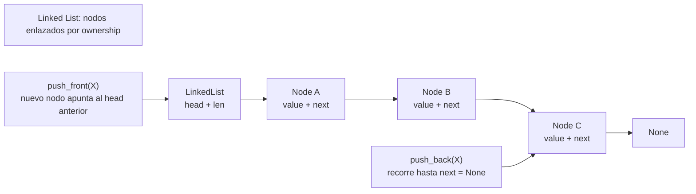

# Linked List

> **Curso:** rust-data-structures · **Capítulo:** 02 · **Prerequisitos:** Capítulo 01, Vector
> **Código:** [`src/linked_list.rs`](../src/linked_list.rs) · **Video:** pendiente
> **Lección en el sitio:** pendiente

## Introducción

Una lista enlazada representa una secuencia como nodos conectados. Cada nodo
guarda un valor y un enlace al siguiente nodo. A diferencia del vector, sus
elementos no viven necesariamente en memoria contigua: la estructura se recorre
siguiendo enlaces.

Este capítulo enseña listas enlazadas simples en Rust seguro. El objetivo no es
decir que son "mejores" que los vectores, sino entender qué ganan y qué pagan:
inserción barata al frente, recorrido secuencial natural y peor localidad de
memoria.

## Motivación

Imagina una cola de reintentos para trabajos fallidos: procesas el primer trabajo,
quizá agregas otros al final, y rara vez necesitas acceso aleatorio por índice.
Un vector puede resolverlo, pero remover del frente obliga a desplazar elementos.
Una lista enlazada permite tomar el primer nodo cambiando un enlace.

La lista enlazada existe para casos donde la forma natural del problema es
seguir enlaces y mover nodos, no saltar a posiciones arbitrarias. Esa diferencia
es la razón por la que aparece justo después de `Vector`: enseña el contraste
entre memoria contigua y nodos dispersos.

## Teoría

### Historia

Las listas enlazadas son una de las estructuras clásicas de la programación de
sistemas. Aparecen temprano porque permiten construir colecciones dinámicas sin
tener que mover todos los elementos cuando se inserta al frente o cuando se
reconecta una parte de la estructura.

En lenguajes con punteros manuales, una lista enlazada suele enseñarse como
"nodo + puntero". En Rust, el mismo concepto obliga a ser más preciso: ¿quién es
dueño del nodo?, ¿quién destruye la cadena?, ¿puede existir un enlace colgante?
Por eso este capítulo es una buena introducción a ownership aplicado.

### Fundamentos

Nuestra lista usa una representación simple:

```rust
pub struct LinkedList<T> {
    head: Option<Box<Node<T>>>,
    len: usize,
}
```

Cada `Node<T>` contiene un valor y un `next`. La lista posee el primer nodo. Cada
nodo posee el siguiente. Cuando la lista se destruye, la cadena completa se
destruye por ownership.

Invariantes principales:

- `len` es el número de nodos alcanzables desde `head`.
- Si `len == 0`, `head == None`.
- Si `len > 0`, `head == Some(...)`.
- El último nodo tiene `next == None`.

Esta implementación no guarda un puntero al último nodo. Eso mantiene el diseño
seguro y fácil de enseñar, pero hace que `push_back`, `pop_back` y `back` sean
O(n): hay que recorrer desde `head`.

### Casos de uso

Las listas enlazadas sirven cuando el patrón dominante es secuencial:

- Pilas con `push_front` y `pop_front`.
- Colas simples cuando se acepta recorrer para insertar al final.
- Cadenas de manejadores o pasos de procesamiento.
- Estructuras donde los nodos se reconectan con frecuencia.
- Fundamento conceptual para estructuras más avanzadas como skip lists.

También son valiosas pedagógicamente: muestran ownership, movimiento de valores,
destrucción de nodos y el costo real de perder localidad de memoria.

### Ventajas y limitaciones

Ventajas:

- `push_front` y `pop_front` son O(1).
- No requiere mover todos los elementos al insertar al frente.
- Cada nodo puede tener vida y ownership claros.
- Es una base conceptual para estructuras enlazadas más complejas.

Limitaciones:

- Acceso por índice es O(n) si se implementa.
- `push_back` es O(n) en esta versión sin puntero a cola.
- Peor localidad de caché que un vector.
- Más asignaciones pequeñas.
- Más complejidad conceptual por nodos y enlaces.

### Comparación con alternativas

Un vector suele ser mejor si necesitas recorrer muchos elementos, acceder por
índice o aprovechar caché. Una lista enlazada gana cuando la operación central
está cerca de la cabeza y no necesitas acceso aleatorio.

Un deque es mejor si necesitas operaciones eficientes en ambos extremos. Una
lista doblemente enlazada puede remover desde ambos lados con más flexibilidad,
pero introduce enlaces hacia atrás y más invariantes. Una lista intrusiva puede
evitar asignaciones por nodo, pero ya pertenece a programación de bajo nivel y
normalmente requiere `unsafe`.

## Diagramas

El diagrama principal vive en
[`diagrams/02-linked-list.mmd`](../diagrams/02-linked-list.mmd).



## Análisis de complejidad

| Operación | Mejor caso | Caso promedio | Peor caso | Espacio |
|-----------|------------|---------------|-----------|---------|
| `new` | O(1) | O(1) | O(1) | O(1) |
| `len` / `is_empty` | O(1) | O(1) | O(1) | O(1) |
| `push_front` | O(1) | O(1) | O(1) | O(1) por nodo |
| `push_back` | O(1) en lista vacía | O(n) | O(n) | O(1) por nodo |
| `pop_front` | O(1) | O(1) | O(1) | O(1) |
| `pop_back` | O(1) en 0/1 nodo | O(n) | O(n) | O(1) |
| `front` | O(1) | O(1) | O(1) | O(1) |
| `back` | O(1) en 0/1 nodo | O(n) | O(n) | O(1) |
| `remove` | O(1) si índice 0 | O(n) | O(n) | O(1) |
| `clear` | O(n) | O(n) | O(n) | O(1) adicional |
| `iter` | O(1) crear, O(n) consumir | O(n) | O(n) | O(1) |

El costo de `push_back` es deliberado: al no guardar `tail`, la lista debe
recorrer todos los nodos hasta encontrar `next == None`. Esa decisión simplifica
la implementación segura y deja visible el tradeoff.

## Visualización interactiva (opcional)

No aplica todavía. El movimiento de nodos se entiende con diagrama, ejemplos y
pruebas; una visualización se agregará cuando `academy-web` tenga definido el
mecanismo de playgrounds.

## Implementación

La implementación completa vive en [`src/linked_list.rs`](../src/linked_list.rs).

El núcleo es:

```rust
struct Node<T> {
    value: T,
    next: Option<Box<Node<T>>>,
}
```

`push_front` toma el `head` actual y lo convierte en `next` del nuevo nodo. Esa
operación no recorre nada:

```rust
let next = self.head.take();
self.head = Some(Box::new(Node { value, next }));
```

`push_back`, en cambio, camina por enlaces mutables hasta encontrar el hueco:

```rust
let mut cursor = &mut self.head;
while let Some(node) = cursor {
    cursor = &mut node.next;
}
*cursor = Some(new_node);
```

El iterador guarda el próximo nodo como referencia:

```rust
pub struct Iter<'a, T> {
    next: Option<&'a Node<T>>,
}
```

Cada llamada a `next()` devuelve el valor actual y avanza al enlace siguiente.
No copia ni mueve valores.

## Pruebas

Las pruebas viven en [`tests/linked_list_test.rs`](../tests/linked_list_test.rs)
y dentro del módulo de implementación.

Cubren:

- Lista vacía y transiciones de un solo elemento.
- `push_front` / `pop_front`.
- `push_back` / `pop_back`.
- `front` y `back`.
- Remoción de cabeza, medio, cola e índice inexistente.
- Iteración en orden.
- `clear` y destrucción de valores.
- Consistencia de `len` tras operaciones mixtas.

Los doc-comments también se verifican con `cargo test --doc`.

## Benchmarks

El benchmark vive en
[`benches/linked_list_bench.rs`](../benches/linked_list_bench.rs) y se ejecuta
con:

```bash
cargo bench --bench linked_list_bench
```

Mide:

- `push_front`;
- `push_back`;
- `pop_front`;
- iteración sobre lista enlazada;
- iteración sobre vector como comparación de localidad.

El resultado esperado es que `push_front` y `pop_front` sean baratos, mientras
que `push_back` sea mucho más caro por recorrer desde la cabeza. La comparación
con vector ayuda a recordar que una estructura con operaciones asintóticas
atractivas puede perder en práctica por localidad de memoria.

## Ejercicios

### Ejercicio 1: Invertir entrada `[Nivel 1]`

Construye una lista que reciba los valores `1, 2, 3, 4` y los deje en orden
inverso usando solo `push_front`.

**Entrada/Salida esperada:** `[4, 3, 2, 1]`.

<details>
<summary>Pista</summary>
Cada nuevo valor insertado al frente queda antes de todos los anteriores.
</details>

### Ejercicio 2: Mover frente al final `[Nivel 2]`

Implementa una función que tome el primer elemento de una lista y lo agregue al
final.

**Entrada/Salida esperada:** `["a", "b", "c"]` queda como `["b", "c", "a"]`.

<details>
<summary>Pista</summary>
Combina `pop_front` con `push_back`.
</details>

### Ejercicio 3: Remover alternados `[Nivel 3]`

Remueve cada segundo elemento de una lista. Para `1..=8`, el resultado debe ser
`[1, 3, 5, 7]`.

**Entrada/Salida esperada:** `[1, 3, 5, 7]`.

<details>
<summary>Pista</summary>
Después de remover en un índice, el siguiente elemento se desplaza a ese mismo
índice lógico.
</details>

### Ejercicio 4: Cola de reintentos `[Nivel 4]`

Diseña una cola de reintentos para trabajos fallidos. Decide si basta esta lista
simple, si necesitas guardar `tail`, o si conviene otra estructura. Explica las
operaciones dominantes y sus costos.

**Entrada/Salida esperada:** no hay salida única; se evalúa el razonamiento.

<details>
<summary>Pista</summary>
Si insertas al final todo el tiempo, una lista simple sin `tail` te cobra O(n)
por cada inserción.
</details>

## Soluciones

Soluciones ejecutables de niveles 1 a 3:

- [`examples/soluciones/linked_list_reverse_input.rs`](../examples/soluciones/linked_list_reverse_input.rs)
- [`examples/soluciones/linked_list_move_front_to_back.rs`](../examples/soluciones/linked_list_move_front_to_back.rs)
- [`examples/soluciones/linked_list_remove_every_other.rs`](../examples/soluciones/linked_list_remove_every_other.rs)

Discusión para el nivel 4:

Una lista simple es adecuada si procesas por el frente y agregas poco al final.
Si cada trabajo fallido se reencola al final constantemente, guardar un `tail`
vuelve natural la operación, pero en Rust seguro ese diseño requiere más cuidado:
un puntero crudo exigiría `unsafe`, y una solución con `Rc<RefCell<_>>` cambia el
modelo de ownership. Un `VecDeque` puede ser la estructura práctica correcta si
solo necesitas una cola eficiente en ambos extremos.

## Conexiones con cursos futuros

En `rust-algorithms`, las listas enlazadas reaparecen como representación mental
para recorridos, ventanas y técnicas de punteros. La lección que se arrastra no
es que una lista enlazada sea "mejor" que un vector, sino que la forma de enlazar
nodos cambia las operaciones disponibles, la localidad de memoria y las
invariantes que un algoritmo puede asumir.

## Referencias

- Donald Knuth, *The Art of Computer Programming*, Vol. 1, secciones sobre
  estructuras enlazadas.
- Robert Sedgewick y Kevin Wayne, *Algorithms*, secciones sobre listas enlazadas
  y pilas/colas.
- Rust Standard Library, `std::collections::LinkedList`, documentación y notas de
  uso.
- Rustonomicon, capítulos sobre ownership, punteros y por qué estructuras
  enlazadas avanzadas suelen requerir invariantes más estrictas.
