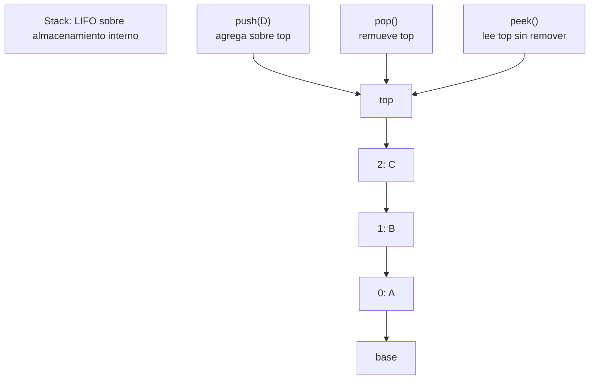

# Stack

> **Curso:** rust-data-structures · **Capítulo:** 03 · **Prerequisitos:** Capítulo 01, Vector; Capítulo 02, Linked List
> **Código:** [`src/stack.rs`](../src/stack.rs) · **Video:** pendiente
> **Lección en el sitio:** pendiente

## Introducción

Una pila (*stack*) es una colección LIFO: *last in, first out*. El último valor
que entra es el primero que sale. Esa regla es más importante que la forma de
almacenamiento; una pila puede respaldarse con un vector, una lista enlazada u
otra estructura.

En este capítulo implementamos `Stack<T>` sobre el `Vector<T>` del capítulo 1.
Así se ve una idea central del curso: muchas estructuras no son solo memoria,
sino contratos de uso. El contrato de la pila es simple: `push`, `pop`, `peek`,
underflow controlado y orden LIFO.

## Motivación

Cuando un editor ofrece "deshacer", guarda acciones en el orden en que ocurrieron,
pero la siguiente acción que debe deshacer es la última. Cuando un parser revisa
paréntesis, el cierre actual debe coincidir con la apertura más reciente. Cuando
un recorrido usa DFS iterativo, el siguiente nodo sale del tope.

En todos esos casos no necesitamos insertar en medio ni buscar por índice. Solo
queremos trabajar con el tope. Una pila existe para expresar ese patrón sin
exponer operaciones que distraen o rompen la intención.

## Teoría

### Historia

Las pilas aparecen en arquitectura de computadoras, lenguajes de programación y
algoritmos desde muy temprano. La pila de llamadas guarda frames de funciones:
la función más reciente debe terminar antes de volver a la anterior. Las máquinas
virtuales basadas en pila evalúan expresiones empujando operandos y aplicando
operaciones sobre el tope.

Su valor histórico y práctico viene de una restricción: al limitar el acceso al
tope, la estructura se vuelve fácil de razonar.

### Fundamentos

La pila expone estas operaciones:

- `push(value)`: agrega un valor al tope.
- `pop()`: remueve el tope y lo devuelve.
- `peek()`: lee el tope sin removerlo.
- `peek_mut()`: modifica el tope sin cambiar la profundidad.
- `clear()`: vacía la pila.
- `iter()`: recorre desde la base hasta el tope.

La invariante semántica es:

```text
si push(a) ocurre antes que push(b), entonces pop() devuelve b antes que a
```

Nuestra implementación guarda el tope al final del vector interno. Eso hace que
`push` use `Vector::push` y `pop` use `Vector::pop`, ambas operaciones eficientes
para el final de la colección.

### Casos de uso

Usos clásicos:

- Undo/redo.
- Validación de paréntesis y delimitadores.
- Evaluación de expresiones.
- DFS iterativo.
- Historial de navegación.
- Call stack conceptual de un programa.

### Ventajas y limitaciones

Ventajas:

- API mínima y clara.
- `push`, `pop` y `peek` baratos.
- Underflow representado con `Option<T>`, sin pánico.
- Fácil de respaldar con diferentes estructuras.

Limitaciones:

- No permite acceso arbitrario sin romper la abstracción.
- Iterar expone lectura, pero no debe reemplazar el contrato LIFO.
- Un vector puede mover memoria al crecer.
- Una lista enlazada puede evitar crecimiento por bloque, pero paga asignaciones
  por nodo y peor localidad.

### Comparación con alternativas

Una pila respaldada por vector aprovecha memoria contigua y `push/pop` al final.
Una pila respaldada por lista enlazada puede hacer `push_front/pop_front` en O(1),
pero asigna un nodo por valor. En la práctica, para valores pequeños y muchos
recorridos, la localidad del vector suele ganar.

Un deque también puede actuar como pila, pero expone más operaciones de las que
el concepto necesita. La decisión no es solo rendimiento: una API más pequeña
enseña y protege la intención.

## Diagramas

El diagrama principal vive en [`diagrams/03-stack.mmd`](../diagrams/03-stack.mmd).



## Análisis de complejidad

| Operación | Mejor caso | Caso promedio | Peor caso | Espacio |
|-----------|------------|---------------|-----------|---------|
| `new` | O(1) | O(1) | O(1) | O(1) |
| `with_capacity(n)` | O(n) | O(n) | O(n) | O(n) |
| `len` / `capacity` / `is_empty` | O(1) | O(1) | O(1) | O(1) |
| `push` | O(1) | O(1) amortizado | O(n) si crece | O(n) si crece |
| `pop` | O(1) | O(1) | O(1) | O(1) |
| `peek` / `peek_mut` | O(1) | O(1) | O(1) | O(1) |
| `clear` | O(n) | O(n) | O(n) | O(1) |
| `iter` | O(1) crear, O(n) consumir | O(n) | O(n) | O(1) |

El peor caso de `push` aparece cuando el vector interno debe crecer. Aun así, el
costo amortizado es O(1), igual que en el capítulo de `Vector`.

## Visualización interactiva (opcional)

No aplica todavía. La pila se entiende con el diagrama, los ejemplos de
undo/parsing y los benchmarks; se agregará playground cuando `academy-web` tenga
ese mecanismo definido.

## Implementación

La implementación vive en [`src/stack.rs`](../src/stack.rs).

El tipo es pequeño:

```rust
pub struct Stack<T> {
    items: Vector<T>,
}
```

`push` delega al final del vector:

```rust
pub fn push(&mut self, value: T) {
    self.items.push(value);
}
```

`peek` calcula el último índice sin restar sobre cero:

```rust
self.items
    .len()
    .checked_sub(1)
    .and_then(|index| self.items.get(index))
```

Ese detalle importa: una pila vacía no debe provocar underflow aritmético ni
pánico. Devuelve `None`, porque no hay tope.

## Pruebas

Las pruebas viven en [`tests/stack_test.rs`](../tests/stack_test.rs) y dentro de
[`src/stack.rs`](../src/stack.rs).

Cubren:

- Underflow: `pop` y `peek` sobre pila vacía.
- Orden LIFO.
- `peek` sin remover.
- `peek_mut` modificando solo el tope.
- `clear` conservando capacidad.
- Iteración desde base hasta tope.
- Movimiento de ownership con `pop`.
- Destrucción de valores restantes con `clear`.

Los doc-comments se validan con `cargo test --doc`.

## Benchmarks

El benchmark vive en [`benches/stack_bench.rs`](../benches/stack_bench.rs) y se
ejecuta con:

```bash
cargo bench --bench stack_bench
```

Mide:

- `push/pop` con stack respaldado por vector;
- `push_front/pop_front` con lista enlazada como comparación;
- `peek` repetido.

La comparación existe para enseñar tradeoffs. Ambas estrategias pueden sostener
operaciones LIFO baratas, pero el vector suele tener mejor localidad y la lista
evita crecimiento por bloque a cambio de asignar nodos.

## Ejercicios

### Ejercicio 1: Trazar operaciones `[Nivel 1]`

Ejecuta la secuencia `push(A)`, `push(B)`, `pop()` y registra el tope después de
cada paso.

**Entrada/Salida esperada:** `[Some("A"), Some("B"), Some("A")]`.

<details>
<summary>Pista</summary>
`pop` remueve `B`, por eso `A` vuelve a quedar como tope.
</details>

### Ejercicio 2: Paréntesis balanceados `[Nivel 2]`

Implementa una función que determine si una cadena tiene paréntesis, corchetes y
llaves balanceados.

**Entrada/Salida esperada:** `([]{})` es válido; `([)]` no lo es.

<details>
<summary>Pista</summary>
Empuja aperturas y compara cada cierre contra la apertura más reciente.
</details>

### Ejercicio 3: Undo/redo `[Nivel 3]`

Modela dos pilas: una para undo y otra para redo. Mover el tope de una pila a la
otra debe preservar el valor exacto.

**Entrada/Salida esperada:** deshacer y rehacer una acción deja la pila de undo
con esa acción nuevamente en el tope.

<details>
<summary>Pista</summary>
`pop` transfiere ownership; no necesitas clonar.
</details>

### Ejercicio 4: Parser iterativo `[Nivel 4]`

Diseña un parser o recorrido de árbol que use una pila explícita en vez de
recursión. Explica qué guardas en cada frame y por qué el orden LIFO es correcto.

**Entrada/Salida esperada:** no hay una única solución; se evalúa el diseño y
sus invariantes.

<details>
<summary>Pista</summary>
Piensa en reemplazar el call stack por una estructura que tú controlas.
</details>

## Soluciones

Soluciones ejecutables de niveles 1 a 3:

- [`examples/soluciones/stack_trace_operations.rs`](../examples/soluciones/stack_trace_operations.rs)
- [`examples/soluciones/stack_balanced_parentheses.rs`](../examples/soluciones/stack_balanced_parentheses.rs)
- [`examples/soluciones/stack_undo_redo.rs`](../examples/soluciones/stack_undo_redo.rs)

Discusión para el nivel 4:

Una pila explícita es útil cuando quieres controlar el recorrido, evitar
recursión profunda o guardar estado adicional por frame. El tradeoff es que el
programa debe hacer visible lo que antes hacía el call stack: qué falta visitar,
qué resultado parcial existe y cuándo se termina un frame.

## Referencias

- Thomas H. Cormen, Charles E. Leiserson, Ronald L. Rivest, Clifford Stein,
  *Introduction to Algorithms*, secciones sobre pilas, colas y DFS.
- Robert Sedgewick y Kevin Wayne, *Algorithms*, secciones introductorias de
  stacks y expresión de algoritmos con LIFO.
- Rust Standard Library, `Vec<T>` y `Option<T>`, como base para una pila segura.
- Rust Book, capítulos de ownership y borrowing, para entender por qué `pop`
  transfiere valores.
