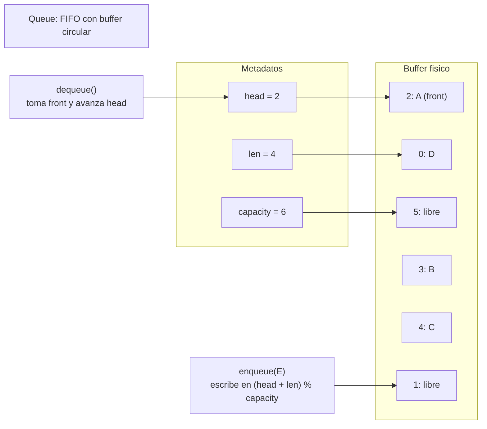

# Queue

> **Curso:** rust-data-structures · **Capitulo:** 04 · **Prerequisitos:** Capitulo 01, Vector; Capitulo 02, Linked List
> **Codigo:** [`src/queue.rs`](../src/queue.rs) · **Video:** pendiente
> **Leccion en el sitio:** pendiente

## Introduccion

Una cola (*queue*) es una coleccion FIFO: *first in, first out*. El primer valor
que entra es el primero que sale. Esa regla aparece cada vez que queremos
respetar orden de llegada: solicitudes, tareas pendientes, turnos de atencion o
fronteras de exploracion.

En este capitulo implementamos `Queue<T>` como buffer circular seguro. La API
expone `enqueue`, `dequeue`, `front`, `back`, `clear` e `iter`. La representacion
usa un arreglo de ranuras opcionales, un indice `head` y una longitud logica.
Asi separamos el contrato FIFO de los detalles fisicos de memoria.

## Motivacion

Una cola ingenua puede construirse con un vector: insertar al final y remover del
frente. El problema es que remover el primer elemento obliga a desplazar todos
los elementos restantes. Si haces eso miles de veces, pagas un costo que la API
oculta pero el sistema siente.

La cola existe para decir algo mas preciso: no necesitamos acceso arbitrario ni
inserciones en medio. Necesitamos aceptar valores por un extremo y entregarlos
por el otro. Esa restriccion permite usar un buffer circular y reutilizar espacio
sin mover todos los elementos en cada `dequeue`.

## Teoria

### Historia

Las colas son una de las estructuras clasicas de sistemas. Aparecen en
schedulers, buffers de red, colas de impresion, simulaciones, procesamiento por
lotes y recorridos BFS. En todos esos escenarios hay una idea de justicia o de
orden temporal: lo que llego antes debe tener oportunidad antes.

Tambien son una pieza de diseno. Elegir una cola comunica que el orden importa,
pero solo como orden de llegada. Si el siguiente elemento debe elegirse por
prioridad, la estructura correcta ya no es una cola simple; es un heap o una
cola de prioridad.

### Fundamentos

La cola expone estas operaciones:

- `enqueue(value)`: agrega un valor al fondo.
- `dequeue()`: remueve el frente y devuelve su valor.
- `front()`: lee el frente sin removerlo.
- `back()`: lee el fondo sin removerlo.
- `clear()`: vacia la cola.
- `iter()`: recorre del frente al fondo.

La invariante semantica es:

```text
si enqueue(a) ocurre antes que enqueue(b), entonces dequeue() devuelve a antes que b
```

La invariante de representacion de nuestro buffer circular es:

```text
indice_fisico = (head + desplazamiento_logico) % capacity
```

`head` apunta al frente logico. `len` dice cuantos valores validos existen. El
fondo no se guarda como campo: se calcula con `head + len - 1`. Para insertar,
usamos `(head + len) % capacity`.

### Casos de uso

Usos clasicos:

- Schedulers FIFO.
- Fronteras de BFS.
- Procesamiento de solicitudes.
- Buffers de eventos.
- Simulaciones de turnos.
- Pipelines donde el productor y el consumidor trabajan a ritmos distintos.

### Ventajas y limitaciones

Ventajas:

- API pequena y expresiva.
- `enqueue`, `dequeue`, `front` y `back` baratos.
- Underflow representado con `Option<T>`, sin panico.
- Reutiliza ranuras liberadas por `dequeue`.
- Evita desplazar todos los elementos al remover del frente.

Limitaciones:

- No ofrece acceso arbitrario; esa restriccion protege el contrato FIFO.
- `enqueue` puede crecer y mover valores cuando la capacidad se agota.
- La aritmetica modular vuelve mas delicadas las invariantes internas.
- No resuelve prioridades; si el orden depende de peso o urgencia, usa un heap.

### Comparacion con alternativas

Una cola sobre lista enlazada puede hacer `push_back` y `pop_front` en O(1) si
mantiene punteros a ambos extremos. El costo es una asignacion por nodo y peor
localidad de memoria.

Una cola ingenua sobre vector puede insertar atras en O(1) amortizado, pero
remover del frente cuesta O(n) porque desplaza elementos. Es facil de escribir y
facil de medir como lenta.

Una cola circular usa memoria contigua, reutiliza ranuras y mantiene
`enqueue/dequeue` en O(1) amortizado. La biblioteca estandar de Rust ofrece
`VecDeque<T>` para este mismo patron de uso en produccion. Nuestra `Queue<T>` lo
implementa con una API deliberadamente pequena para estudiar la representacion.

## Diagramas

El diagrama principal vive en [`diagrams/04-queue.mmd`](../diagrams/04-queue.mmd).



## Analisis de complejidad

| Operacion | Mejor caso | Caso promedio | Peor caso | Espacio |
|-----------|------------|---------------|-----------|---------|
| `new` | O(1) | O(1) | O(1) | O(1) |
| `with_capacity(n)` | O(n) | O(n) | O(n) | O(n) |
| `len` / `capacity` / `is_empty` | O(1) | O(1) | O(1) | O(1) |
| `enqueue` | O(1) | O(1) amortizado | O(n) si crece | O(n) si crece |
| `dequeue` | O(1) | O(1) | O(1) | O(1) |
| `front` / `back` | O(1) | O(1) | O(1) | O(1) |
| `clear` | O(n) | O(n) | O(n) | O(1) |
| `iter` | O(1) crear, O(n) consumir | O(n) | O(n) | O(1) |

El peor caso de `enqueue` aparece cuando la cola esta llena y debe crecer. En
ese crecimiento copiamos los valores en orden logico hacia un buffer nuevo con
`head = 0`. Despues de crecer, el orden FIFO queda linealizado.

## Visualizacion interactiva (opcional)

No aplica todavia. La cola se entiende con el diagrama, los ejemplos de
wraparound y los benchmarks; se agregara playground cuando `academy-web` tenga
ese mecanismo definido.

## Implementacion

La implementacion vive en [`src/queue.rs`](../src/queue.rs).

El tipo guarda la representacion minima:

```rust
pub struct Queue<T> {
    items: Box<[Option<T>]>,
    head: usize,
    len: usize,
}
```

`enqueue` calcula la ranura fisica donde termina la cola:

```rust
let tail = self.physical_index(self.len);
self.items[tail] = Some(value);
self.len += 1;
```

`dequeue` toma ownership del frente, limpia la ranura y avanza `head`:

```rust
let value = self.items[self.head].take();
self.head = self.physical_index(1);
self.len -= 1;
```

Cuando `len` llega a cero, `head` vuelve a `0`. Ese detalle no cambia la
semantica, pero simplifica el estado interno y hace mas facil razonar sobre una
cola recien vaciada.

El crecimiento es la parte mas delicada: no basta con copiar el arreglo fisico,
porque el orden logico puede estar partido por el final del buffer. Por eso
`grow` recorre `0..len`, calcula cada indice fisico viejo y deposita los valores
en posiciones lineales del nuevo buffer.

## Pruebas

Las pruebas viven en [`tests/queue_test.rs`](../tests/queue_test.rs) y dentro de
[`src/queue.rs`](../src/queue.rs).

Cubren:

- Underflow: `dequeue`, `front` y `back` sobre cola vacia.
- Orden FIFO.
- Reutilizacion de ranuras despues de `dequeue`.
- Crecimiento despues de wraparound.
- `clear` conservando capacidad.
- Iteracion del frente al fondo.
- Movimiento de ownership con `dequeue`.
- Destruccion de valores restantes con `clear`.

Los doc-comments se validan con `cargo test --doc`.

## Benchmarks

El benchmark vive en [`benches/queue_bench.rs`](../benches/queue_bench.rs) y se
ejecuta con:

```bash
cargo bench --bench queue_bench
```

Mide:

- `enqueue/dequeue` con buffer circular;
- remocion ingenua del frente usando `Vector::remove(0)`;
- reutilizacion de ranuras por wraparound.

La comparacion existe para que el costo de desplazar elementos deje de ser una
idea abstracta. En una cola larga, remover del frente de un vector convierte una
operacion conceptual simple en trabajo repetido sobre casi toda la coleccion.

## Ejercicios

### Ejercicio 1: Trazar orden FIFO `[Nivel 1]`

Ejecuta la secuencia `enqueue(A)`, `enqueue(B)`, `dequeue()`, `enqueue(C)`,
`dequeue()`, `dequeue()` y registra los valores devueltos.

**Entrada/Salida esperada:** `[Some("A"), Some("B"), Some("C")]`.

<details>
<summary>Pista</summary>
`enqueue(C)` ocurre despues de remover `A`, pero `B` ya estaba esperando.
</details>

### Ejercicio 2: Round-robin `[Nivel 2]`

Modela tareas con un contador de pasos restantes. En cada turno, remueve la
tarea del frente, reduce su contador y vuelve a encolarla si aun no termina.

**Entrada/Salida esperada:** con `docs: 2` y `tests: 1`, el orden de terminacion
es `["tests", "docs"]`.

<details>
<summary>Pista</summary>
Una tarea incompleta vuelve al fondo para dar oportunidad a las demas.
</details>

### Ejercicio 3: Filtrar trabajos listos `[Nivel 3]`

Dada una cola de trabajos con bandera `ready`, consume la cola y devuelve solo
los nombres de los trabajos listos en orden FIFO.

**Entrada/Salida esperada:** `index(true)`, `email(false)`, `report(true)`
produce `["index", "report"]`.

<details>
<summary>Pista</summary>
`dequeue` transfiere ownership del trabajo; puedes decidir si conservarlo o
descartarlo sin clonarlo.
</details>

### Ejercicio 4: Backpressure en solicitudes `[Nivel 4]`

Disena una cola de solicitudes con limite de capacidad y una politica explicita
cuando se llena: rechazar, esperar, soltar lo mas viejo o fusionar trabajos.
Explica que invariante protege tu politica.

**Entrada/Salida esperada:** no hay una unica solucion; se evalua el diseno y
la claridad de sus invariantes.

<details>
<summary>Pista</summary>
Una cola no solo ordena: tambien puede marcar el punto donde un sistema decide
que hacer cuando recibe mas trabajo del que puede procesar.
</details>

## Soluciones

Soluciones ejecutables de niveles 1 a 3:

- [`examples/soluciones/queue_trace_order.rs`](../examples/soluciones/queue_trace_order.rs)
- [`examples/soluciones/queue_round_robin.rs`](../examples/soluciones/queue_round_robin.rs)
- [`examples/soluciones/queue_filter_ready_jobs.rs`](../examples/soluciones/queue_filter_ready_jobs.rs)

Discusion para el nivel 4:

La politica de backpressure debe elegirse segun el dominio. Rechazar conserva
memoria y latencia, pero puede perder trabajo. Esperar conserva solicitudes,
pero aumenta latencia y puede bloquear productores. Soltar lo mas viejo sirve
para eventos donde solo importa el estado reciente. Fusionar trabajos exige mas
logica, pero puede reducir trabajo duplicado. La invariante importante es que el
sistema no acepte trabajo ilimitado sin una decision explicita.

## Conexiones con cursos futuros

Mas adelante, `rust-algorithms` reutilizara `Queue` para BFS, procesamiento por
niveles, simulaciones discretas y planificacion FIFO. Aqui solo fijamos FIFO,
buffer circular e invariantes de crecimiento.

## Referencias

- Thomas H. Cormen, Charles E. Leiserson, Ronald L. Rivest, Clifford Stein,
  *Introduction to Algorithms*, secciones sobre colas y BFS.
- Robert Sedgewick y Kevin Wayne, *Algorithms*, secciones introductorias de
  queues y recorridos FIFO.
- Rust Standard Library, `VecDeque<T>`, como cola circular de produccion.
- Rust Book, capitulos de ownership y borrowing, para entender por que
  `dequeue` transfiere valores.
