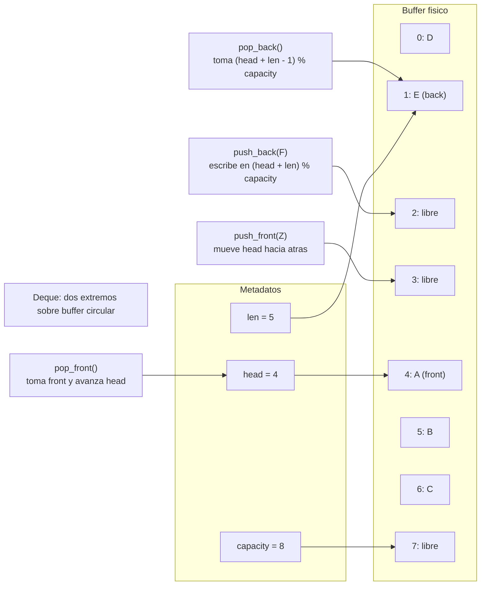

# Deque

> **Curso:** rust-data-structures · **Capitulo:** 05 · **Prerequisitos:** Capitulo 01, Vector; Capitulo 02, Linked List; Capitulo 04, Queue
> **Codigo:** [`src/deque.rs`](../src/deque.rs) · **Video:** pendiente
> **Leccion en el sitio:** pendiente

## Introduccion

Un deque (*double-ended queue*) es una cola de doble extremo. Permite insertar y
remover por el frente y por el fondo: `push_front`, `push_back`, `pop_front` y
`pop_back`.

La idea importante no es "hacer de todo". Un deque sigue siendo una estructura
con contrato claro: optimiza trabajo en los extremos y, si ofrece acceso por
indice, ese indice se interpreta desde el frente logico, no desde la memoria
fisica.

En este capitulo implementamos `Deque<T>` como buffer circular seguro. Es una
extension natural de `Queue<T>`: donde la cola mueve un solo extremo de lectura,
el deque permite que ambos extremos participen en el flujo.

## Motivacion

Hay problemas donde una pila o una cola son demasiado estrechas. Un algoritmo de
ventana deslizante necesita sacar valores vencidos por el frente y eliminar
candidatos peores por el fondo. Un historial de navegador puede tratar el fondo
como pagina actual y el frente como elementos fijados. Una cola de trabajo puede
poner tareas urgentes al frente y tareas normales al fondo.

Usar un vector para eso puede ser costoso si insertas o remueves del frente: los
elementos deben desplazarse. Usar una lista enlazada evita desplazamientos, pero
paga asignaciones y pierde localidad. Un deque con buffer circular busca el
punto medio: extremos baratos y memoria contigua.

## Teoria

### Historia

Los deques aparecen como generalizacion practica de pilas y colas. En sistemas,
se usan para work stealing, scheduling, buffers de eventos y caches. En
algoritmos, son centrales para ventanas monotonicamente ordenadas y para BFS 0-1,
donde algunas aristas se agregan al frente y otras al fondo.

La leccion historica es la misma del curso: la estructura no es solo una bolsa
de operaciones. Es una forma de expresar que los extremos importan mas que el
centro.

### Fundamentos

El deque expone estas operaciones:

- `push_front(value)`: agrega un valor al frente.
- `push_back(value)`: agrega un valor al fondo.
- `pop_front()`: remueve el frente.
- `pop_back()`: remueve el fondo.
- `front()` / `back()`: leen extremos sin remover.
- `get(index)`: lee por indice logico desde el frente.
- `clear()`: vacia el deque.
- `iter()`: recorre del frente al fondo.

La invariante de representacion es:

```text
indice_fisico = (head + indice_logico) % capacity
```

`head` apunta al frente logico. `len` dice cuantos valores validos hay. El fondo
se calcula con `head + len - 1`. `push_front` mueve `head` hacia atras; `push_back`
escribe despues del ultimo elemento logico.

### Casos de uso

Usos clasicos:

- Ventanas deslizantes.
- Work queues con tareas urgentes y normales.
- Historiales de navegacion.
- Buffers de eventos.
- BFS 0-1.
- Simulaciones donde entran y salen entidades por ambos extremos.

### Ventajas y limitaciones

Ventajas:

- Operaciones O(1) amortizadas en ambos extremos.
- Memoria contigua y mejor localidad que una lista enlazada.
- Underflow representado con `Option<T>`.
- Acceso por indice logico O(1).
- Reutiliza ranuras liberadas por ambos lados.

Limitaciones:

- Insertar o remover en medio no forma parte del contrato.
- El crecimiento puede mover valores.
- La aritmetica modular hace mas delicada la implementacion.
- `get(index)` es rapido, pero no convierte al deque en reemplazo universal de
  un vector; el modelo mental principal siguen siendo los extremos.

### Comparacion con alternativas

Una pila es un deque usado por un solo extremo. Una cola es un deque con entrada
por el fondo y salida por el frente. Un vector ofrece acceso contiguo simple,
pero insertar/remover al frente cuesta O(n). Una lista enlazada hace extremos
baratos, pero asigna nodos y no tiene acceso indexado eficiente.

La biblioteca estandar ofrece `VecDeque<T>` para uso real de produccion. Nuestro
`Deque<T>` existe para estudiar las invariantes: `head`, `len`, wraparound,
crecimiento y lectura logica sobre memoria fisica no lineal.

## Diagramas

El diagrama principal vive en [`diagrams/05-deque.mmd`](../diagrams/05-deque.mmd).



## Analisis de complejidad

| Operacion | Mejor caso | Caso promedio | Peor caso | Espacio |
|-----------|------------|---------------|-----------|---------|
| `new` | O(1) | O(1) | O(1) | O(1) |
| `with_capacity(n)` | O(n) | O(n) | O(n) | O(n) |
| `len` / `capacity` / `is_empty` | O(1) | O(1) | O(1) | O(1) |
| `push_front` / `push_back` | O(1) | O(1) amortizado | O(n) si crece | O(n) si crece |
| `pop_front` / `pop_back` | O(1) | O(1) | O(1) | O(1) |
| `front` / `back` / `get` | O(1) | O(1) | O(1) | O(1) |
| `clear` | O(n) | O(n) | O(n) | O(1) |
| `iter` | O(1) crear, O(n) consumir | O(n) | O(n) | O(1) |

Cuando el buffer crece, los valores se copian en orden logico a un nuevo arreglo
y `head` vuelve a `0`. Ese paso convierte temporalmente el costo en O(n), pero
mantiene O(1) amortizado para inserciones en los extremos.

## Visualizacion interactiva (opcional)

No aplica todavia. El wraparound del deque se entiende con el diagrama, los
tests y los ejemplos; se agregara playground cuando `academy-web` defina el
mecanismo de visualizacion.

## Implementacion

La implementacion vive en [`src/deque.rs`](../src/deque.rs).

El tipo guarda la misma base conceptual que `Queue<T>`:

```rust
pub struct Deque<T> {
    items: Box<[Option<T>]>,
    head: usize,
    len: usize,
}
```

`push_back` escribe al final logico:

```rust
let index = self.physical_index(self.len);
self.items[index] = Some(value);
self.len += 1;
```

`push_front` mueve `head` hacia atras antes de escribir:

```rust
self.head = (self.head + self.capacity() - 1) % self.capacity();
self.items[self.head] = Some(value);
self.len += 1;
```

`pop_front` avanza `head`; `pop_back` calcula el ultimo indice logico y toma el
valor. En ambos casos, si `len` queda en cero, `head` vuelve a `0` para mantener
un estado vacio simple.

## Pruebas

Las pruebas viven en [`tests/deque_test.rs`](../tests/deque_test.rs) y dentro de
[`src/deque.rs`](../src/deque.rs).

Cubren:

- Underflow en ambos extremos.
- `push_front`, `push_back`, `pop_front` y `pop_back`.
- Reutilizacion de ranuras por ambos extremos.
- Crecimiento despues de wraparound.
- Preservacion del orden logico.
- `get(index)` sobre indices logicos.
- `clear` conservando capacidad.
- Movimiento de ownership con `pop_*`.
- Destruccion de valores restantes con `clear`.

Los doc-comments se validan con `cargo test --doc`.

## Benchmarks

El benchmark vive en [`benches/deque_bench.rs`](../benches/deque_bench.rs) y se
ejecuta con:

```bash
cargo bench --bench deque_bench
```

Mide:

- `push_front/pop_front`;
- `push_back/pop_back`;
- `get(index)` por indice logico;
- lista enlazada como comparacion de frente;
- vector con remocion frontal ingenua.

La comparacion no busca coronar una estructura universal. Busca mostrar donde
cada contrato paga: el deque hace baratos ambos extremos; el vector castiga el
frente; la lista evita desplazamientos pero renuncia a localidad e indexado
barato.

## Ejercicios

### Ejercicio 1: Trazar extremos `[Nivel 1]`

Ejecuta `push_back(B)`, `push_front(A)`, `push_back(C)`, `pop_front()`,
`pop_back()`, `pop_front()` y registra los valores devueltos.

**Entrada/Salida esperada:** `[Some("A"), Some("C"), Some("B")]`.

<details>
<summary>Pista</summary>
El frente y el fondo pueden cambiar sin mover los valores intermedios.
</details>

### Ejercicio 2: Maximo de ventana deslizante `[Nivel 2]`

Usa un deque de indices para calcular el maximo de cada ventana de tamano `k`.

**Entrada/Salida esperada:** `[4, 2, 12, 3, 8]` con `k = 3` produce
`[12, 12, 12]`.

<details>
<summary>Pista</summary>
Manten en el deque solo indices candidatos cuyo valor pueda seguir siendo maximo.
</details>

### Ejercicio 3: Historial de navegador `[Nivel 3]`

Modela un historial donde el fondo representa la pagina actual y el frente puede
recibir paginas fijadas. Implementa una funcion `go_back`.

**Entrada/Salida esperada:** despues de volver desde `"capitulo"`, el historial
con pin `"pin-roadmap"` queda como `["pin-roadmap", "inicio", "curso"]`.

<details>
<summary>Pista</summary>
`pop_back` representa salir de la pagina actual; `push_front` representa fijar
algo por delante del recorrido normal.
</details>

### Ejercicio 4: Work stealing `[Nivel 4]`

Disena una cola de trabajo donde el trabajador local toma del fondo y otros
trabajadores roban del frente. Explica que invariantes hacen que esa politica
sea razonable.

**Entrada/Salida esperada:** no hay una unica solucion; se evalua el diseno y
la claridad de sus invariantes.

<details>
<summary>Pista</summary>
Separar extremos puede reducir contencion conceptual: un lado expresa trabajo
local reciente y el otro trabajo disponible para repartir.
</details>

## Soluciones

Soluciones ejecutables de niveles 1 a 3:

- [`examples/soluciones/deque_trace_ends.rs`](../examples/soluciones/deque_trace_ends.rs)
- [`examples/soluciones/deque_sliding_window.rs`](../examples/soluciones/deque_sliding_window.rs)
- [`examples/soluciones/deque_browser_history.rs`](../examples/soluciones/deque_browser_history.rs)

Discusion para el nivel 4:

Work stealing usa el deque para dar significados distintos a cada extremo. El
trabajador local puede tomar trabajo reciente del fondo, mientras que otros
trabajadores roban unidades mas antiguas desde el frente. La invariante clave es
que cada tarea vive una sola vez en el deque y que cada extraccion transfiere
ownership logico de esa tarea.

## Referencias

- Thomas H. Cormen, Charles E. Leiserson, Ronald L. Rivest, Clifford Stein,
  *Introduction to Algorithms*, secciones sobre colas, BFS y estructuras
  elementales.
- Robert Sedgewick y Kevin Wayne, *Algorithms*, secciones sobre queues, deques y
  ventanas de procesamiento.
- Rust Standard Library, `VecDeque<T>`, como deque circular de produccion.
- Rust Book, capitulos de ownership y borrowing, para entender por que `pop_*`
  transfiere valores.
