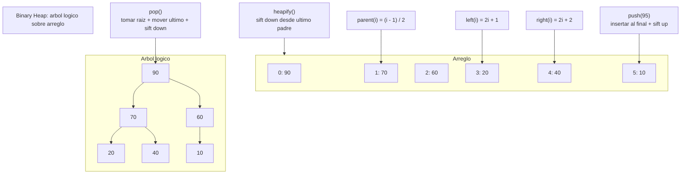

# Heap

> **Curso:** rust-data-structures · **Capitulo:** 06 · **Prerequisitos:** Capitulo 01, Vector; Capitulo 05, Deque
> **Codigo:** [`src/heap.rs`](../src/heap.rs) · **Video:** pendiente
> **Leccion en el sitio:** pendiente

## Introduccion

Un heap binario es una estructura para seleccionar extremos por prioridad. En un
max-heap, la raiz contiene el valor mas grande. En un min-heap, la raiz contiene
el valor mas pequeno. Esa garantia no ordena toda la coleccion; solo mantiene
barato consultar y remover la siguiente prioridad.

En este capitulo implementamos `Heap<T>` como max-heap y `MinHeap<T>` como
min-heap. Ambos usan un `Vec<T>` como arreglo interno, sin nodos ni punteros. El
arbol es logico: los indices del arreglo determinan padre e hijos.

## Motivacion

Una cola FIFO atiende por orden de llegada. Un stack atiende lo mas reciente. Un
heap atiende por prioridad. Esa diferencia aparece en schedulers, top-k,
Dijkstra, simuladores y sistemas donde la siguiente accion no es "la primera"
ni "la ultima", sino "la mas importante segun una regla".

Podriamos mantener un vector siempre ordenado, pero insertar puede costar O(n).
Podriamos ordenar todo cada vez, pero seria todavia mas caro. El heap acepta un
orden parcial: no todo queda ordenado, pero el extremo prioritario queda siempre
en la raiz.

## Teoria

### Historia

Los heaps aparecen como respuesta practica al problema de colas de prioridad.
El heap binario es especialmente importante porque representa un arbol completo
con un arreglo compacto. Esa decision le da buena localidad de memoria y evita
asignaciones por nodo.

Tambien es una estructura puente: aparece en heapsort, en seleccion de top-k, en
colas de prioridad para grafos y en sistemas de scheduling.

### Fundamentos

Un max-heap mantiene esta propiedad:

```text
para todo nodo i: items[parent(i)] >= items[i]
```

Un min-heap invierte la comparacion:

```text
para todo nodo i: items[parent(i)] <= items[i]
```

La representacion en arreglo usa estas formulas:

```text
parent(i) = (i - 1) / 2
left(i) = 2i + 1
right(i) = 2i + 2
```

Operaciones centrales:

- `push(value)`: inserta al final y aplica `sift_up`.
- `pop()`: remueve la raiz, mueve el ultimo valor a la raiz y aplica
  `sift_down`.
- `peek()`: lee la raiz sin remover.
- `from_vec(values)`: ejecuta `heapify` bottom-up.
- `iter_level_order()`: expone la representacion interna nivel por nivel.

### Casos de uso

Usos clasicos:

- Colas de prioridad.
- Scheduling por urgencia o deadline.
- Dijkstra y Prim.
- Top-k queries.
- Heapsort.
- Simulaciones de eventos discretos.

### Ventajas y limitaciones

Ventajas:

- `peek` en O(1).
- `push` y `pop` en O(log n).
- `heapify` en O(n).
- Representacion contigua con buena localidad.
- No requiere nodos enlazados.

Limitaciones:

- No mantiene todos los valores ordenados.
- Buscar un valor arbitrario sigue siendo O(n).
- Remover elementos que no son la raiz no es el caso fuerte.
- Un comparador custom completo requiere una API mas amplia; aqui usamos `Ord`
  y dos variantes educativas: max-heap y min-heap.

### Comparacion con alternativas

Un vector sin ordenar inserta en O(1) amortizado, pero encontrar el maximo cuesta
O(n). Un vector ordenado puede sacar el extremo barato, pero insertar cuesta
O(n). Un arbol balanceado mantiene orden total con operaciones O(log n), pero
paga mas punteros y complejidad.

`std::collections::BinaryHeap<T>` es la opcion de produccion en Rust para un
max-heap. Nuestra implementacion existe para estudiar las invariantes: arreglo,
propiedad de heap, `sift_up`, `sift_down` y `heapify`.

## Diagramas

El diagrama principal vive en [`diagrams/06-heap.mmd`](../diagrams/06-heap.mmd).



## Analisis de complejidad

| Operacion | Mejor caso | Caso promedio | Peor caso | Espacio |
|-----------|------------|---------------|-----------|---------|
| `new` | O(1) | O(1) | O(1) | O(1) |
| `with_capacity(n)` | O(1) | O(1) | O(1) | O(n) reservado |
| `from_vec` / `heapify` | O(n) | O(n) | O(n) | O(1) extra |
| `len` / `capacity` / `is_empty` | O(1) | O(1) | O(1) | O(1) |
| `peek` | O(1) | O(1) | O(1) | O(1) |
| `push` | O(1) si no sube | O(log n) | O(log n) | O(n) si crece |
| `pop` | O(1) con un elemento | O(log n) | O(log n) | O(1) |
| `clear` | O(n) | O(n) | O(n) | O(1) |
| `iter_level_order` | O(1) crear, O(n) consumir | O(n) | O(n) | O(1) |

`heapify` es O(n), no O(n log n), porque la mayoria de nodos estan cerca de las
hojas y bajan pocos niveles.

## Visualizacion interactiva (opcional)

No aplica todavia. El heap se entiende con el diagrama, los ejemplos de `sift`
y los benchmarks; se agregara playground cuando `academy-web` defina ese
mecanismo.

## Implementacion

La implementacion vive en [`src/heap.rs`](../src/heap.rs).

El max-heap guarda solo un vector:

```rust
pub struct Heap<T> {
    items: Vec<T>,
}
```

`push` inserta al final y sube mientras el padre tenga menor prioridad:

```rust
self.items.push(value);
self.sift_up(self.len() - 1);
```

`pop` remueve la raiz sin dejar huecos: toma el ultimo valor, lo mueve a la raiz
y baja hasta restaurar la propiedad de heap.

`MinHeap<T>` usa la misma representacion, pero invierte las comparaciones. Eso
mantiene el capitulo centrado en invariantes sin introducir una API de
comparadores custom antes de tiempo.

## Pruebas

Las pruebas viven en [`tests/heap_test.rs`](../tests/heap_test.rs) y dentro de
[`src/heap.rs`](../src/heap.rs).

Cubren:

- Underflow en `peek` y `pop`.
- Orden descendente para max-heap.
- Orden ascendente para min-heap.
- Preservacion de duplicados.
- `heapify` desde valores existentes.
- Propiedad padre/hijo despues de `heapify`.
- `clear` conservando capacidad.
- Movimiento de ownership con `pop`.
- Destruccion de valores restantes con `clear`.

Los doc-comments se validan con `cargo test --doc`.

## Benchmarks

El benchmark vive en [`benches/heap_bench.rs`](../benches/heap_bench.rs) y se
ejecuta con:

```bash
cargo bench --bench heap_bench
```

Mide:

- `push/pop` con nuestro heap;
- `heapify` desde un vector;
- `std::collections::BinaryHeap`;
- vector ordenado como cola de prioridad ingenua.

La comparacion con `BinaryHeap` es importante: la biblioteca estandar es la
opcion correcta para produccion. Nuestro heap existe para abrir la caja negra y
explicar por que esa API funciona.

## Ejercicios

### Ejercicio 1: Trazar pop order `[Nivel 1]`

Inserta `4`, `10`, `7`, `1` en un max-heap y registra los valores devueltos por
`pop`.

**Entrada/Salida esperada:** `[10, 7, 4, 1]`.

<details>
<summary>Pista</summary>
El arreglo interno no esta completamente ordenado, pero la raiz siempre contiene
el maximo.
</details>

### Ejercicio 2: Top-k `[Nivel 2]`

Usa un min-heap de tamano `k` para mantener los `k` valores mas grandes de una
secuencia.

**Entrada/Salida esperada:** `[12, 4, 20, 7, 18, 2]` con `k = 3` produce
`[20, 18, 12]`.

<details>
<summary>Pista</summary>
El minimo entre los candidatos vive en la raiz; si llega un valor mayor, puede
reemplazarlo.
</details>

### Ejercicio 3: Frontera de Dijkstra `[Nivel 3]`

Modela estados con `cost` y `node` en un min-heap. La frontera debe entregar el
estado de menor costo primero.

**Entrada/Salida esperada:** costos `10`, `2`, `5` se procesan como `2`, `5`,
`10`.

<details>
<summary>Pista</summary>
Deriva o implementa `Ord` para que `cost` sea el primer campo de comparacion.
</details>

### Ejercicio 4: Comparador custom `[Nivel 4]`

Disena una extension de API para prioridades custom sin cambiar el contrato
basico de heap. Decide si prefieres un wrapper de datos, una funcion comparadora
almacenada o tipos separados.

**Entrada/Salida esperada:** no hay una unica solucion; se evalua el diseno y
sus tradeoffs de ergonomia, monomorfizacion y claridad.

<details>
<summary>Pista</summary>
Rust ya permite muchos casos con wrappers que implementan `Ord`. Un comparador
almacenado da flexibilidad, pero complica el tipo.
</details>

## Soluciones

Soluciones ejecutables de niveles 1 a 3:

- [`examples/soluciones/heap_trace_pop_order.rs`](../examples/soluciones/heap_trace_pop_order.rs)
- [`examples/soluciones/heap_top_k.rs`](../examples/soluciones/heap_top_k.rs)
- [`examples/soluciones/heap_dijkstra_frontier.rs`](../examples/soluciones/heap_dijkstra_frontier.rs)

Discusion para el nivel 4:

Este capitulo usa `Ord` y tipos separados (`Heap<T>`, `MinHeap<T>`) para mantener
el aprendizaje enfocado. Para prioridades custom, un wrapper que implemente
`Ord` suele ser la primera opcion porque mantiene el heap simple. Un comparador
almacenado puede ser util, pero obliga a decidir como se guarda la funcion, como
se clona y como afecta la firma publica.

## Conexiones con cursos futuros

Mas adelante, `rust-algorithms` reutilizara `Heap` para heapsort, top-k,
seleccion por prioridad, Dijkstra, Prim y planificadores. Aqui solo fijamos
propiedad heap, `sift up`, `sift down`, `heapify` e invariantes.

## Referencias

- Thomas H. Cormen, Charles E. Leiserson, Ronald L. Rivest, Clifford Stein,
  *Introduction to Algorithms*, secciones de heaps y heapsort.
- Robert Sedgewick y Kevin Wayne, *Algorithms*, secciones de priority queues.
- Rust Standard Library, `std::collections::BinaryHeap`.
- Rust Book, traits `Ord`, `Eq`, `PartialOrd` y `PartialEq`.
