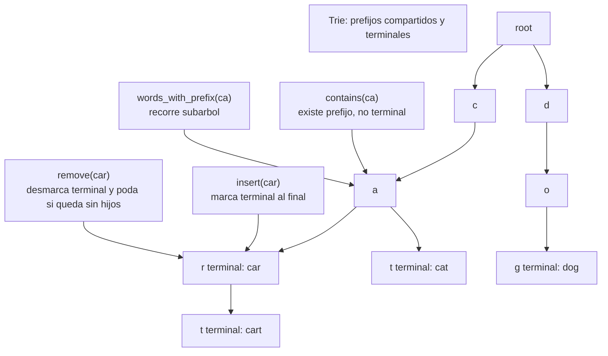

# Trie

> **Curso:** rust-data-structures · **Capitulo:** 07 · **Prerequisitos:** Capitulo 01, Vector; Capitulo 10 del curriculum, strings basicos
> **Codigo:** [`src/trie.rs`](../src/trie.rs) · **Video:** pendiente
> **Leccion en el sitio:** pendiente

## Introduccion

Un trie es un arbol de prefijos. Cada arista representa una parte de una clave y
cada nodo puede marcar si el camino hasta ahi forma una palabra terminal. Su
fuerza aparece cuando muchas claves comparten prefijos: `car`, `cart` y `cat`
comparten trabajo en vez de duplicarlo por completo.

En este capitulo implementamos `Trie` para palabras representadas como
secuencias de `char` de Rust. Eso significa que soportamos valores escalares
Unicode, pero no hacemos normalizacion Unicode: `"é"` y `"e\u{301}"` son claves
distintas.

## Motivacion

Un `HashMap` responde muy bien a busquedas exactas, pero no sabe naturalmente
contestar "dame todas las palabras que empiezan con `app`". Un vector ordenado
puede hacerlo con busqueda binaria y escaneo, pero sigue comparando strings
completos o rangos. Un trie guarda el prefijo como camino compartido.

La idea no es que el trie reemplace a todos los mapas. Es una estructura para
cuando el prefijo es parte central del problema: autocomplete, diccionarios,
rutas, comandos, prefijos de red o indices de texto acotados.

## Teoria

### Historia

Los tries aparecen en busqueda de cadenas, compiladores, diccionarios,
autocompletado y ruteo. Su nombre viene de *retrieval*. La idea es convertir una
clave secuencial en un camino: cada paso consume una unidad de la clave y decide
que rama tomar.

Esa representacion sacrifica memoria por estructura. Un nodo puede tener pocos
hijos, y guardar mapas por nodo puede ser costoso. A cambio, las operaciones
dependen de la longitud de la clave, no del numero total de palabras.

### Fundamentos

Operaciones principales:

- `insert(word)`: crea el camino y marca terminal.
- `contains(word)`: busca palabra exacta y exige terminal.
- `starts_with(prefix)`: busca camino, aunque no sea terminal.
- `words_with_prefix(prefix)`: recorre el subarbol del prefijo.
- `remove(word)`: desmarca terminal y poda ramas muertas.
- `node_count()`: muestra el costo de representacion.

La invariante principal es:

```text
una palabra existe si su camino existe y el ultimo nodo esta marcado terminal
```

Por eso `contains("ca")` puede ser falso aunque `starts_with("ca")` sea
verdadero.

### Politica Unicode

Este trie recorre `word.chars()`. En Rust, `char` representa un valor escalar
Unicode, no un byte. Eso permite guardar `"niño"` o `"🚀rust"` sin romper indices
por byte.

Pero no hacemos normalizacion. Las cadenas canonicas equivalentes para humanos
pueden tener representaciones distintas y, por tanto, claves distintas. Esa
decision mantiene el capitulo enfocado en tries; normalizacion Unicode pertenece
a un tema de strings y texto.

### Casos de uso

Usos clasicos:

- Autocomplete.
- Diccionarios y validacion de palabras.
- Prefijos de rutas.
- Comandos de CLI.
- Tablas de prefijos.
- Filtros por prefijo en interfaces de busqueda.

### Ventajas y limitaciones

Ventajas:

- Busqueda por prefijo natural.
- Operaciones proporcionales a la longitud de la clave.
- Prefijos compartidos entre palabras.
- Puede enumerar resultados desde un prefijo.
- Borrado puede podar ramas que ya no se usan.

Limitaciones:

- Puede consumir mas memoria que un `HashMap`.
- Cada nodo necesita una estructura para hijos.
- No ofrece hashing de clave completa.
- La salida lexicografica depende del orden de `char`, no de reglas humanas de
  idioma.
- Sin normalizacion Unicode, claves visualmente parecidas pueden ser distintas.

### Comparacion con alternativas

Un `HashMap<String, V>` es excelente para busqueda exacta promedio O(1), pero no
resuelve prefijos sin escanear. Un vector ordenado puede hacer busqueda por
rango y tiene buena localidad, pero insertar cuesta mover elementos. Un B-tree
mantiene orden y rangos con buen comportamiento de memoria, pero no comparte
prefijos internamente.

Un radix tree comprime caminos de un solo hijo y puede ahorrar memoria. Un
automata finito puede representar lenguajes o diccionarios con otra clase de
optimizaciones. Este capitulo usa un trie sin compresion porque ensena la
invariante base con claridad.

## Diagramas

El diagrama principal vive en [`diagrams/07-trie.mmd`](../diagrams/07-trie.mmd).



## Analisis de complejidad

Sea `m` la longitud de la clave en `char`, `a` el numero de hijos de un nodo y
`r` el tamano de la salida.

| Operacion | Mejor caso | Caso promedio | Peor caso | Espacio |
|-----------|------------|---------------|-----------|---------|
| `new` | O(1) | O(1) | O(1) | O(1) |
| `len` / `is_empty` | O(1) | O(1) | O(1) | O(1) |
| `insert` | O(m log a) | O(m log a) | O(m log a) | O(m) nodos nuevos |
| `contains` | O(m log a) | O(m log a) | O(m log a) | O(1) |
| `starts_with` | O(m log a) | O(m log a) | O(m log a) | O(1) |
| `words_with_prefix` | O(m log a) | O(m log a + r) | O(n) | O(r) |
| `remove` | O(m log a) | O(m log a) | O(m log a) | O(1) extra |
| `clear` | O(n) | O(n) | O(n) | O(1) |
| `node_count` | O(n) | O(n) | O(n) | O(1) |

Usamos `BTreeMap<char, Node>` para que la salida sea determinista y ordenada por
`char`. Eso hace que buscar hijos sea O(log a). Un arreglo fijo o un hashmap por
nodo tendrian otros tradeoffs.

## Visualizacion interactiva (opcional)

No aplica todavia. El trie se entiende con el diagrama de prefijos compartidos,
los ejemplos de autocomplete y las pruebas de borrado; se agregara playground
cuando `academy-web` tenga ese mecanismo definido.

## Implementacion

La implementacion vive en [`src/trie.rs`](../src/trie.rs).

El tipo publico conserva solo raiz y contador:

```rust
pub struct Trie {
    root: Node,
    len: usize,
}
```

Cada nodo guarda terminalidad e hijos:

```rust
struct Node {
    is_terminal: bool,
    children: BTreeMap<char, Node>,
}
```

`insert` camina por `word.chars()` y crea nodos si faltan. `contains` reutiliza
`find_node`, pero exige que el nodo final sea terminal. `starts_with` solo exige
que el camino exista.

`remove` es recursivo: desmarca la terminal y devuelve si el hijo quedo vacio
para poder podarlo. Esa poda es el detalle que evita dejar ramas muertas despues
de borrar palabras.

## Pruebas

Las pruebas viven en [`tests/trie_test.rs`](../tests/trie_test.rs) y dentro de
[`src/trie.rs`](../src/trie.rs).

Cubren:

- Insercion y busqueda exacta.
- Diferencia entre palabra y prefijo.
- Cadena vacia como palabra terminal valida.
- Prefijos compartidos.
- Borrado sin romper hermanos.
- Poda de ramas muertas.
- Busqueda por prefijo ordenada.
- Politica Unicode por `char` sin normalizacion.
- Reuso despues de `clear`.

Los doc-comments se validan con `cargo test --doc`.

## Benchmarks

El benchmark vive en [`benches/trie_bench.rs`](../benches/trie_bench.rs) y se
ejecuta con:

```bash
cargo bench --bench trie_bench
```

Mide:

- lookup exacto en trie;
- lookup exacto con `HashSet`;
- busqueda de prefijo en trie;
- busqueda de prefijo en vector ordenado.

La comparacion ensena el tradeoff: `HashSet` suele ganar busqueda exacta; el
trie existe cuando el prefijo es una operacion de primera clase.

## Ejercicios

### Ejercicio 1: Trazar prefijos `[Nivel 1]`

Inserta `car`, `cart` y `cat`. Explica por que `contains("ca")` es falso pero
`starts_with("ca")` es verdadero.

**Entrada/Salida esperada:** `words_with_prefix("car")` devuelve
`["car", "cart"]`.

<details>
<summary>Pista</summary>
El nodo `a` existe, pero no esta marcado como terminal.
</details>

### Ejercicio 2: Autocomplete limitado `[Nivel 2]`

Implementa una funcion que devuelva como maximo `k` sugerencias para un prefijo.

**Entrada/Salida esperada:** con `app`, `apple`, `apply`, `apt`, `backend` y
prefijo `ap`, las primeras 3 sugerencias son `["app", "apple", "apply"]`.

<details>
<summary>Pista</summary>
Puedes tomar los primeros `k` elementos de `words_with_prefix`.
</details>

### Ejercicio 3: Politica Unicode `[Nivel 3]`

Inserta `"é"`, `"e\u{301}"` y `"🚀rust"`. Comprueba que las dos primeras claves
son distintas y que el prefijo `"🚀"` encuentra `"🚀rust"`.

**Entrada/Salida esperada:** ambas formas de `e` existen como palabras
separadas.

<details>
<summary>Pista</summary>
El trie recorre `chars()`: no compara equivalencia canonica humana.
</details>

### Ejercicio 4: Radix tree `[Nivel 4]`

Disena como comprimirias caminos de un solo hijo para convertir este trie en un
radix tree. Explica que cambia en `insert`, `contains` y `remove`.

**Entrada/Salida esperada:** no hay una unica solucion; se evalua la claridad de
las invariantes.

<details>
<summary>Pista</summary>
Un nodo podria guardar segmentos de string en vez de un solo `char`.
</details>

## Soluciones

Soluciones ejecutables de niveles 1 a 3:

- [`examples/soluciones/trie_trace_prefixes.rs`](../examples/soluciones/trie_trace_prefixes.rs)
- [`examples/soluciones/trie_autocomplete.rs`](../examples/soluciones/trie_autocomplete.rs)
- [`examples/soluciones/trie_unicode_policy.rs`](../examples/soluciones/trie_unicode_policy.rs)

Discusion para el nivel 4:

Un radix tree reduce memoria al compactar cadenas de nodos con un solo hijo.
El costo es que cada operacion debe comparar segmentos, partir nodos cuando hay
divergencia y cuidar mas casos en borrado. La invariante deja de ser "un nodo
por char" y pasa a ser "un nodo por segmento comun".

## Conexiones con cursos futuros

Mas adelante, `rust-algorithms` reutilizara `Trie` para autocomplete, matching
por prefijo, diccionarios, ruteo por cadenas y busquedas sobre alfabetos. Aqui
solo fijamos nodos, terminales, prefijos y politica Unicode.

## Referencias

- Robert Sedgewick y Kevin Wayne, *Algorithms*, secciones de tries.
- Donald Knuth, *The Art of Computer Programming*, busqueda digital.
- Rust Standard Library, `BTreeMap` y `str::chars`.
- Unicode Standard, normalizacion canonica como tema separado de la estructura.
