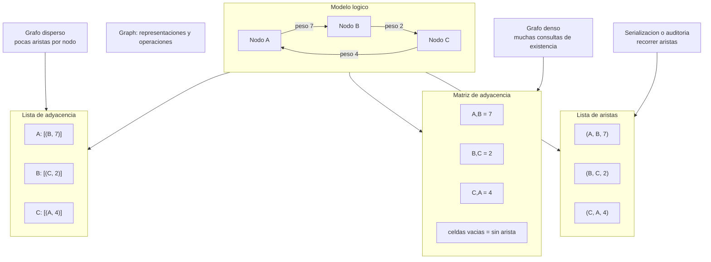

# Graph

> **Curso:** rust-data-structures · **Capitulo:** 08 · **Prerequisitos:** Capitulos 01, 03 y 04; nociones basicas de conjuntos y relaciones
> **Codigo:** [`src/graph.rs`](../src/graph.rs) · **Video:** pendiente
> **Leccion en el sitio:** pendiente

## Introduccion

Un grafo modela relaciones. Los nodos representan entidades; las aristas
representan conexiones entre ellas. Esa idea aparece en dependencias entre
crates, amistades, rutas, redes, permisos, procesos, mapas de conocimiento y
planes de estudio.

Este capitulo no intenta ensenar todos los algoritmos sobre grafos. Ese trabajo
vive en `rust-algorithms`. Aqui el objetivo es anterior y mas fundamental:
entender como representar un grafo, que invariantes debe mantener y que costo
tienen sus operaciones basicas.

## Motivacion

Muchas estructuras anteriores tienen una forma lineal o jerarquica: vector,
lista, cola, pila, heap, trie. Un grafo abre otro tipo de problema: una entidad
puede estar conectada con muchas otras y esas conexiones pueden tener direccion,
peso o ambas cosas.

En una lista enlazada preguntas "cual es el siguiente nodo?". En un grafo
preguntas "que vecinos tiene este nodo?", "existe esta relacion?", "cuanto
cuesta moverse de A a B?", "esta dependencia permitida?". La estructura ya no
solo guarda valores; guarda relaciones.

## Teoria

### Historia

Los grafos vienen de la matematica discreta y se volvieron una herramienta
central en ciencias de la computacion. Sirven para hablar de caminos, redes,
planificacion, compiladores, sistemas distribuidos y datos conectados.

En ingenieria, lo importante no es memorizar una definicion elegante, sino saber
escoger una representacion. Un mismo grafo logico puede vivir como lista de
adyacencia, matriz de adyacencia o lista de aristas. Cada forma favorece
operaciones distintas.

### Fundamentos

Conceptos base:

- **Nodo:** entidad del dominio.
- **Arista:** relacion entre dos nodos.
- **Dirigido:** `A -> B` no implica `B -> A`.
- **No dirigido:** `A -- B` se lee en ambos sentidos.
- **Ponderado:** la arista tiene un peso, costo o fuerza.
- **No ponderado:** la arista solo indica existencia.
- **Self-loop:** una arista de un nodo hacia si mismo.
- **Vecinos:** nodos alcanzables desde un nodo dado.

La implementacion de este capitulo usa pesos enteros (`i32`) para mantener el
API pequeno y didactico. Un grafo no ponderado puede modelarse usando siempre
el peso `1`.

### Invariantes

Las invariantes principales son:

```text
una arista solo puede existir entre nodos existentes
```

```text
en un grafo no dirigido, una arista A--B se almacena en ambos sentidos pero se
cuenta una sola vez como arista logica
```

```text
un self-loop se cuenta una sola vez
```

Estas reglas parecen pequenas, pero evitan errores clasicos: contar aristas
duplicadas, dejar referencias a nodos removidos o permitir relaciones hacia
nodos fantasma.

### Representaciones

#### Lista de adyacencia

Cada nodo guarda sus vecinos:

```text
A: [(B, 7), (C, 2)]
B: [(C, 4)]
C: []
```

Es una buena representacion para grafos dispersos, donde cada nodo tiene pocas
aristas comparado con el numero total de nodos. Insertar nodos y recorrer
vecinos es natural.

#### Matriz de adyacencia

Una tabla `n x n` guarda si existe arista entre cada par de nodos:

```text
      A   B   C
A   -   7   2
B   -   -   4
C   -   -   -
```

Es atractiva cuando el grafo es denso o cuando preguntar "existe A -> B?" es la
operacion dominante. El costo es memoria: la matriz reserva espacio para todos
los pares posibles, incluso cuando no hay arista.

#### Lista de aristas

Guarda solo conexiones:

```text
(A, B, 7)
(A, C, 2)
(B, C, 4)
```

Es simple para exportar, auditar, ordenar o alimentar algoritmos que recorren
aristas. No es la forma mas comoda para preguntar vecinos de un nodo.

### Limite con algoritmos

Este repo posee la representacion. Las busquedas profundas, caminos minimos,
ordenamiento topologico, componentes conectados, MST y flujo pertenecen a
`rust-algorithms`.

Aqui si mostramos operaciones necesarias para sostener el modelo:

- insertar nodos;
- insertar o actualizar aristas;
- remover aristas;
- remover nodos y limpiar aristas incidentes;
- consultar existencia y peso;
- listar vecinos;
- exportar aristas.

## Diagramas

El diagrama principal vive en [`diagrams/08-graph.mmd`](../diagrams/08-graph.mmd).



## Analisis de complejidad

Sea `n` el numero de nodos, `e` el numero de aristas logicas y `d` el grado de
salida del nodo consultado.

| Operacion | Lista de adyacencia | Matriz de adyacencia | Comentario |
|-----------|---------------------|----------------------|------------|
| `new` | O(1) | O(1) | Sin reservar nodos |
| `add_node` | O(log n) | O(n^2) | La matriz expande filas |
| `add_edge` | O(log n) | O(n) | La matriz busca indices linealmente |
| `has_edge` | O(log n) | O(n) | En esta matriz educativa, localizar nodo cuesta O(n) |
| `edge_weight` | O(log n) | O(n) | Mismo costo de busqueda de indices |
| `neighbors` | O(d) | No implementado | Recorrer fila completa seria O(n) |
| `edges` | O(n + e) | No implementado | La lista ya guarda vecinos |
| `remove_edge` | O(log n) | No implementado | La matriz se mantiene minima aqui |
| `remove_node` | O(n log n + e) | No implementado | Hay que limpiar incidentes |
| Espacio | O(n + e) | O(n^2) | Tradeoff central |

La matriz podria usar un indice auxiliar `BTreeMap<T, usize>` para hacer
consultas de nodos mas rapidas. No se agrega todavia para mantener visible el
costo real de la representacion basica.

## Visualizacion interactiva (opcional)

No aplica todavia. Este capitulo queda listo para una visualizacion futura donde
el estudiante alterne entre lista, matriz y lista de aristas para el mismo grafo
logico.

## Implementacion

La implementacion vive en [`src/graph.rs`](../src/graph.rs).

La lista de adyacencia usa mapas ordenados:

```rust
pub struct Graph<T> {
    directed: bool,
    adjacency: BTreeMap<T, BTreeMap<T, Weight>>,
    edge_count: usize,
}
```

El orden determinista no es accidental. En un curso, que `neighbors` y `edges`
devuelvan resultados estables hace que las pruebas y los ejemplos expliquen
mejor el modelo.

La matriz mantiene nodos y pesos:

```rust
pub struct AdjacencyMatrix<T> {
    directed: bool,
    nodes: Vec<T>,
    weights: Vec<Vec<Option<Weight>>>,
    edge_count: usize,
}
```

`add_edge` valida que ambos nodos existan. En grafos no dirigidos, escribe la
arista espejo cuando `from != to`. Esa condicion conserva el conteo correcto de
self-loops.

`remove_node` es donde mas se nota la diferencia entre representacion fisica y
modelo logico. En grafos no dirigidos, las aristas incidentes aparecen dos veces
en memoria, pero deben descontarse una sola vez.

## Pruebas

Las pruebas viven en [`tests/graph_test.rs`](../tests/graph_test.rs) y dentro de
[`src/graph.rs`](../src/graph.rs).

Cubren:

- Insercion de nodos.
- Insercion y actualizacion de aristas.
- Direccion en grafos dirigidos.
- Simetria en grafos no dirigidos.
- Self-loops.
- Errores por nodos inexistentes.
- Remocion de aristas.
- Remocion de nodos y limpieza de aristas incidentes.
- Lista de aristas determinista.
- Matriz de adyacencia dirigida y no dirigida.

Los doc-comments se validan con `cargo test --doc`.

## Benchmarks

El benchmark vive en [`benches/graph_bench.rs`](../benches/graph_bench.rs) y se
ejecuta con:

```bash
cargo bench --bench graph_bench
```

Mide:

- construccion dispersa con lista de adyacencia;
- construccion dispersa con matriz de adyacencia;
- consulta de aristas en lista;
- consulta de aristas en matriz;
- recorrido de vecinos en lista.

La intencion no es declarar un ganador absoluto. El benchmark muestra que una
representacion dispersa suele favorecer a la lista, mientras que la matriz paga
memoria y expansion aunque el grafo tenga pocas aristas.

## Ejercicios

### Ejercicio 1: Dependencias dirigidas `[Nivel 1]`

Crea un grafo dirigido para `api`, `domain`, `database` y `observability`.
Agrega aristas desde el modulo que depende hacia el modulo requerido.

**Entrada/Salida esperada:** `api -> domain` existe, pero `domain -> api` no.

<details>
<summary>Pista</summary>
Las dependencias tienen direccion: quien usa apunta a quien necesita.
</details>

### Ejercicio 2: Vecinos sociales `[Nivel 2]`

Crea un grafo no dirigido con cuatro personas. Agrega amistades con pesos que
representen fuerza de relacion y lista los vecinos de `ana`.

**Entrada/Salida esperada:** si `ana` esta conectada con `beatriz` y `carlos`,
`neighbors("ana")` devuelve ambas relaciones en orden determinista.

<details>
<summary>Pista</summary>
En un grafo no dirigido, agregar `ana -- beatriz` tambien permite consultar
`beatriz -- ana`.
</details>

### Ejercicio 3: Rutas con matriz `[Nivel 3]`

Modela rutas dirigidas entre tres ciudades usando `AdjacencyMatrix`. Consulta
el peso de una ruta existente y confirma que una ruta inversa no existe si no la
agregaste.

**Entrada/Salida esperada:** `edge_weight("mxn", "gdl")` devuelve `Some(9)`.

<details>
<summary>Pista</summary>
La matriz representa existencia por celda. En grafos dirigidos, la celda inversa
es independiente.
</details>

### Ejercicio 4: Elegir representacion `[Nivel 4]`

Compara una red social pequena, un mapa de rutas denso y un archivo de aristas
exportado por otro sistema. Decide que representacion usarias para cada caso y
defiende el tradeoff.

**Entrada/Salida esperada:** no hay una unica solucion; se evalua claridad de
criterios: densidad, memoria, actualizaciones y consultas.

<details>
<summary>Pista</summary>
No preguntes solo "que es mas rapido"; pregunta que operacion domina el sistema.
</details>

## Soluciones

Soluciones ejecutables de niveles 1 a 3:

- [`examples/soluciones/graph_dependency_edges.rs`](../examples/soluciones/graph_dependency_edges.rs)
- [`examples/soluciones/graph_social_neighbors.rs`](../examples/soluciones/graph_social_neighbors.rs)
- [`examples/soluciones/graph_route_matrix.rs`](../examples/soluciones/graph_route_matrix.rs)

Discusion para el nivel 4:

Una red social pequena y cambiante suele favorecer lista de adyacencia: los
vecinos importan y el grafo normalmente es disperso. Un mapa denso con muchas
consultas de existencia puede justificar matriz si la memoria cabe. Un archivo
de intercambio entre sistemas puede ser lista de aristas porque es facil de
serializar, ordenar, auditar y transformar.

## Referencias

- Thomas H. Cormen, Charles E. Leiserson, Ronald L. Rivest y Clifford Stein,
  *Introduction to Algorithms*, capitulos de grafos.
- Robert Sedgewick y Kevin Wayne, *Algorithms*, representaciones de grafos.
- Rust Standard Library, `BTreeMap` y `Vec`.
- RFC-0001 §10 y §14: ubicacion curricular y anatomia de capitulos.
