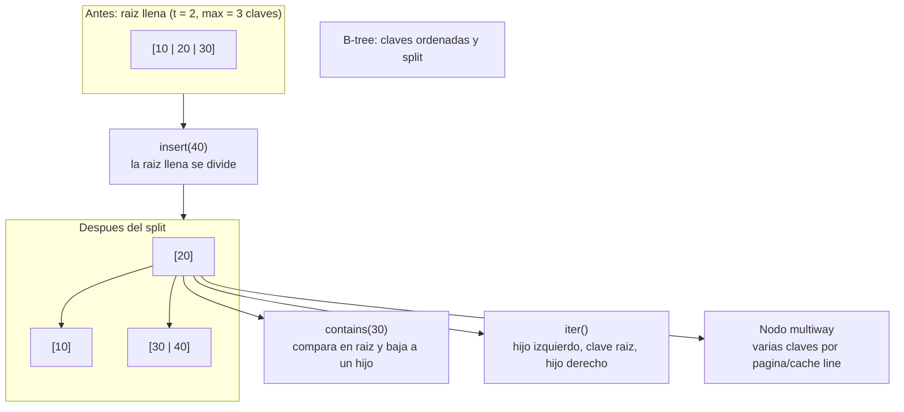

# B-Tree

> **Curso:** rust-data-structures · **Capitulo:** 09 · **Prerequisitos:** Vector, Graph, busqueda binaria y orden total
> **Codigo:** [`src/btree.rs`](../src/btree.rs) · **Video:** pendiente
> **Leccion en el sitio:** pendiente

## Introduccion

Un B-tree es un arbol de busqueda multiway. A diferencia de un arbol binario,
cada nodo puede guardar muchas claves y muchos hijos. Esa decision no es un
detalle cosmetico: esta pensada para memoria real, paginas de disco, cache y
bloques contiguos.

En este capitulo implementamos un B-tree educativo de claves ordenadas. Se
comporta como un conjunto: no guarda duplicados. La implementacion incluye
busqueda, insercion, split de nodos llenos e iteracion ordenada. La eliminacion
se estudia como estrategia, pero no se expone como API hasta que el capitulo
pueda cubrirla con la misma calidad que insercion.

## Motivacion

Un arbol binario de busqueda puede degradarse si no se balancea. Un red-black
tree mantiene balance con rotaciones y colores. Un B-tree toma otro camino:
reduce altura guardando mas claves por nodo.

Esa forma lo vuelve canonico para indices de bases de datos y sistemas de
archivos. Cuando leer un nodo cuesta traer una pagina, conviene que cada pagina
contenga muchas claves utiles. Menos altura significa menos saltos.

## Teoria

### Historia

Los B-trees nacieron para almacenamiento secundario. En disco, el costo dominante
no era comparar enteros sino leer bloques. La estructura fue disenada para
mantener un arbol bajo, ancho y ordenado.

Aunque hoy muchos datos viven en memoria, la idea sigue vigente: localidad,
paginas, caches y estructuras ordenadas siguen importando. Por eso B-tree vuelve
a aparecer mas adelante en internals de bases de datos.

### Fundamentos

Un B-tree con grado minimo `t` mantiene estas reglas:

- Cada nodo puede guardar hasta `2t - 1` claves.
- Cada nodo interno con `k` claves tiene `k + 1` hijos.
- Las claves dentro de cada nodo estan ordenadas.
- Los hijos separan rangos: hijo izquierdo menor, hijo derecho mayor.
- La raiz puede tener menos claves que los demas nodos.
- Cuando un nodo lleno recibe otra clave, se divide y sube su mediana.

Este capitulo usa `t = 2` por defecto para que los splits sean faciles de ver.
Tambien permite `with_min_degree(t)` para observar como cambia la capacidad del
nodo.

### Insercion

La insercion sigue una regla practica: no bajamos hacia un hijo lleno. Si el
hijo esta lleno, primero lo dividimos. Eso garantiza que al llegar a una hoja
haya espacio para insertar.

La operacion critica es `split_child`:

```text
antes:  [10 | 20 | 30]    con t = 2
sube:          20
despues: [10]  20  [30]
```

Si insertamos `40`, el camino baja al hijo derecho y queda `[30 | 40]`.

### Busqueda

Buscar una clave compara dentro del nodo. Si la encuentra, termina. Si no la
encuentra y el nodo es hoja, falla. Si el nodo es interno, baja al hijo cuyo
rango podria contener la clave.

La implementacion usa `binary_search` dentro de cada nodo. En un sistema real,
el tamano de nodo se escoge por pagina o cache line; aqui se escoge por claridad
educativa.

### Eliminacion

Eliminar en B-tree es mas delicado que insertar. No basta con quitar una clave:
hay que conservar ocupacion minima, pedir prestado a hermanos o fusionar nodos.

Estrategia general:

1. Si la clave esta en una hoja, se puede remover directamente si el nodo queda
   con suficientes claves.
2. Si la clave esta en un nodo interno, se reemplaza por predecesor o sucesor.
3. Antes de bajar a un hijo con pocas claves, se repara: prestamo de hermano o
   merge.
4. Si la raiz queda vacia, su unico hijo se convierte en nueva raiz.

No exponemos `remove` todavia porque un capitulo canonico no debe publicar una
eliminacion incompleta. La estrategia queda explicada para que el estudiante vea
el mapa antes de implementarla en una iteracion futura.

### Casos de uso

Usos clasicos:

- Indices de bases de datos.
- Sistemas de archivos.
- Mapas ordenados.
- Indices por rango.
- Almacenamiento por paginas.
- Estructuras persistentes que favorecen bajo numero de lecturas.

### Comparacion con alternativas

Un arbol binario de busqueda es mas pequeno conceptualmente, pero sin balance
puede degradarse. Un red-black tree mantiene altura logaritmica con rotaciones
locales; suele ser buena opcion en memoria. Un skip list usa niveles
probabilisticos y es simple de implementar concurrentemente en algunos disenos.
Un hashmap busca rapido por clave exacta promedio, pero no mantiene orden ni
rangos naturales.

El B-tree brilla cuando importan orden, rangos y localidad. No es "mejor que un
hashmap"; resuelve otro problema.

## Diagramas

El diagrama principal vive en [`diagrams/09-btree.mmd`](../diagrams/09-btree.mmd).



## Analisis de complejidad

Sea `n` el numero de claves y `t` el grado minimo.

| Operacion | Mejor caso | Caso promedio | Peor caso | Espacio |
|-----------|------------|---------------|-----------|---------|
| `new` | O(1) | O(1) | O(1) | O(1) |
| `with_min_degree` | O(1) | O(1) | O(1) | O(1) |
| `len` / `is_empty` | O(1) | O(1) | O(1) | O(1) |
| `contains` | O(1) | O(log n) | O(log n) | O(1) |
| `insert` | O(log n) | O(log n) | O(log n) | O(t) por split |
| `iter` | O(n) | O(n) | O(n) | O(n) referencias |
| `height` | O(log n) | O(log n) | O(log n) | O(1) |

La implementacion materializa referencias en `iter()` para mantener el codigo
del capitulo enfocado en representacion e invariantes. Un iterador productivo
podria usar una pila explicita y no reservar `Vec<&T>`.

## Visualizacion interactiva (opcional)

No aplica todavia. El B-tree es buen candidato para una visualizacion futura:
insertar claves una por una, ver nodos llenos, observar la mediana que sube y
comparar alturas con diferentes grados minimos.

## Implementacion

La implementacion vive en [`src/btree.rs`](../src/btree.rs).

El tipo publico conserva raiz, grado minimo y longitud:

```rust
pub struct BTree<T> {
    root: Node<T>,
    min_degree: usize,
    len: usize,
}
```

Cada nodo guarda claves, hijos y si es hoja:

```rust
struct Node<T> {
    keys: Vec<T>,
    children: Vec<Node<T>>,
    leaf: bool,
}
```

La raiz empieza como hoja vacia. Antes de insertar, `insert` verifica duplicados
con `contains`. Si la raiz esta llena, se crea una nueva raiz interna y se
divide la raiz anterior como primer hijo. Despues la insercion baja por un nodo
que no esta lleno.

El split usa `Vec::split_off` para separar las claves derechas y `pop` para
extraer la mediana. No usa `unsafe`.

## Pruebas

Las pruebas viven en [`tests/btree_test.rs`](../tests/btree_test.rs) y dentro de
[`src/btree.rs`](../src/btree.rs).

Cubren:

- Insercion y busqueda.
- Conteo de claves.
- Politica de duplicados.
- Split de raiz.
- Iteracion ordenada despues de multiples splits.
- Validacion de grado minimo.
- Relacion entre grado minimo y capacidad antes de split.

Los doc-comments se validan con `cargo test --doc`.

## Benchmarks

El benchmark vive en [`benches/btree_bench.rs`](../benches/btree_bench.rs) y se
ejecuta con:

```bash
cargo bench --bench btree_bench
```

Mide:

- insercion ordenada en el B-tree educativo;
- insercion pseudoaleatoria en el B-tree educativo;
- insercion pseudoaleatoria en `std::collections::BTreeSet`;
- busqueda en el B-tree educativo;
- busqueda en `BTreeSet`.

El benchmark no pretende superar a la biblioteca estandar. Sirve para observar
como la estructura mantiene busqueda e insercion ordenadas con altura baja y
nodos multiway.

## Ejercicios

### Ejercicio 1: Trazar un split `[Nivel 1]`

Con grado minimo `2`, inserta `1`, `2`, `3` y `4`. Explica por que la raiz se
divide al insertar la cuarta clave.

**Entrada/Salida esperada:** la altura final es `2` y la raiz tiene `1` clave.

<details>
<summary>Pista</summary>
Con `t = 2`, un nodo puede tener como maximo `3` claves.
</details>

### Ejercicio 2: Indice ordenado `[Nivel 2]`

Inserta claves en desorden y usa `iter()` para producirlas ordenadas.

**Entrada/Salida esperada:** insertar `[30, 10, 20, 40]` produce
`[10, 20, 30, 40]`.

<details>
<summary>Pista</summary>
El recorrido in-order visita hijo izquierdo, clave, hijo derecho.
</details>

### Ejercicio 3: Politica de duplicados `[Nivel 3]`

Inserta dos veces la misma clave y verifica que `len` no cambie.

**Entrada/Salida esperada:** la primera insercion devuelve `true`; la segunda,
`false`.

<details>
<summary>Pista</summary>
Este B-tree modela un conjunto de claves, no un multiset.
</details>

### Ejercicio 4: Disenar eliminacion `[Nivel 4]`

Describe como implementarias `remove` sin romper las invariantes de ocupacion.
Incluye prestamo de hermanos, merge y cambio de raiz.

**Entrada/Salida esperada:** no hay una unica solucion; se evalua que el plan
mantenga ocupacion minima y orden.

<details>
<summary>Pista</summary>
Antes de bajar a un hijo con pocas claves, reparalo.
</details>

## Soluciones

Soluciones ejecutables de niveles 1 a 3:

- [`examples/soluciones/btree_trace_split.rs`](../examples/soluciones/btree_trace_split.rs)
- [`examples/soluciones/btree_ordered_index.rs`](../examples/soluciones/btree_ordered_index.rs)
- [`examples/soluciones/btree_duplicate_policy.rs`](../examples/soluciones/btree_duplicate_policy.rs)

Discusion para el nivel 4:

Una eliminacion completa debe mantener el arbol balanceado y todos los nodos,
salvo la raiz, con ocupacion suficiente. La forma robusta es reparar antes de
bajar: si el hijo tiene pocas claves, toma prestado de un hermano con excedente
o fusiona con un hermano y baja una clave del padre. Si borras una clave interna,
reemplazala por predecesor o sucesor desde un subarbol con espacio suficiente.

## Conexiones con cursos futuros

Mas adelante, `rust-database-internals` reutilizara `BTree` para indices por
pagina, busqueda por rango, fanout, localidad y layouts persistentes. Aqui solo
fijamos busqueda multiway, split, orden e invariantes en memoria.

## Referencias

- Rudolf Bayer y Edward M. McCreight, articulo original sobre B-trees.
- Thomas H. Cormen, Charles E. Leiserson, Ronald L. Rivest y Clifford Stein,
  *Introduction to Algorithms*, capitulo de B-trees.
- Rust Standard Library, `std::collections::BTreeSet`.
- RFC-0001 §10 y §14: ubicacion curricular y anatomia de capitulos.
