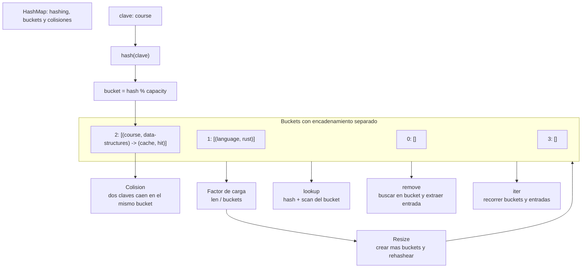

# HashMap

> **Curso:** rust-data-structures · **Capitulo:** 10 · **Prerequisitos:** Vector, B-Tree, hashing basico y tipos con igualdad
> **Codigo:** [`src/hashmap.rs`](../src/hashmap.rs) · **Video:** pendiente
> **Leccion en el sitio:** pendiente

## Introduccion

Un hashmap guarda pares clave-valor y usa una funcion hash para decidir en que
bucket vive cada clave. Su promesa practica es busqueda, insercion y remocion
promedio O(1). Esa promesa depende de una condicion: que las claves se repartan
bien entre buckets.

En este capitulo implementamos una tabla hash educativa con encadenamiento
separado. No busca reemplazar `std::collections::HashMap`; busca hacer visibles
los buckets, las colisiones, el factor de carga y el redimensionamiento.

## Motivacion

Un B-tree mantiene orden y rangos. Un trie entiende prefijos. Un vector puede
buscar con escaneo o busqueda binaria si esta ordenado. Un hashmap responde otra
pregunta: "si tengo esta clave exacta, donde esta su valor?".

Ese patron aparece en caches, indices por id, conteo de frecuencias,
deduplicacion, tablas de simbolos y memoizacion. Cuando el orden no importa y la
clave exacta domina, hashing suele ser la herramienta correcta.

## Teoria

### Fundamentos

Operaciones principales:

- `insert(key, value)`: agrega o reemplaza un par.
- `get(key)`: busca un valor por clave.
- `get_mut(key)`: modifica un valor en su lugar.
- `remove(key)`: elimina una clave y devuelve su valor.
- `contains_key(key)`: prueba pertenencia.
- `iter()`: recorre los pares almacenados.

La implementacion usa `DefaultHasher` de la biblioteca estandar para convertir
una clave en un numero. Luego calcula:

```text
bucket = hash(key) % capacity
```

### Colisiones

Una colision ocurre cuando dos claves distintas caen en el mismo bucket. No es
un error; es parte normal de una tabla hash.

Este capitulo usa **encadenamiento separado**:

```text
bucket 2: [(course, data-structures), (cache, hit)]
```

Buscar dentro de ese bucket requiere comparar claves una por una. Si hay pocas
colisiones, el bucket es corto. Si muchas claves colisionan, el costo deja de
parecer O(1) y se acerca a O(n).

### Factor de carga

El factor de carga mide que tan llena esta la tabla:

```text
load_factor = len / buckets
```

Cuando la carga proyectada supera `0.75`, esta implementacion duplica la cantidad
de buckets y reubica todas las entradas. Ese proceso se llama rehash o resize.
Es costoso cuando ocurre, pero mantiene cortas las cadenas en el caso promedio.

### Encadenamiento vs direccionamiento abierto

En encadenamiento separado, cada bucket contiene una pequena coleccion de
entradas. Es simple de explicar, tolera colisiones de manera directa y hace
`remove` sencillo.

En direccionamiento abierto, todas las entradas viven en el arreglo principal y
las colisiones se resuelven buscando otra posicion. Puede tener mejor localidad,
pero borrar y manejar tombstones requiere mas cuidado.

Este curso implementa encadenamiento separado porque deja ver mejor el concepto
de bucket y colision.

### Casos de uso

Usos comunes:

- Caches por clave exacta.
- Indices por id.
- Conteo de palabras o eventos.
- Deduplicacion.
- Tablas de simbolos en compiladores.
- Lookup de configuracion.

## Comparacion con alternativas

Un B-tree conserva orden y permite rangos; un hashmap no. Un vector ordenado
puede buscar con O(log n), pero insertar cuesta mover elementos. Un trie es
natural para prefijos, no para claves arbitrarias. El hashing perfecto elimina
colisiones para un conjunto conocido de claves, pero no sirve igual para datos
dinamicos.

La eleccion depende del acceso dominante:

- clave exacta dinamica: hashmap;
- rangos y orden: B-tree;
- prefijos: trie;
- datos pequenos o muy cache-friendly: vector;
- claves fijas y conocidas: hashing perfecto.

## Diagramas

El diagrama principal vive en [`diagrams/10-hashmap.mmd`](../diagrams/10-hashmap.mmd).



## Analisis de complejidad

Sea `n` el numero de pares y `b` el numero de buckets.

| Operacion | Mejor caso | Caso promedio | Peor caso | Espacio |
|-----------|------------|---------------|-----------|---------|
| `new` | O(b) | O(b) | O(b) | O(b) |
| `insert` | O(1) | O(1) amortizado | O(n) | O(1), O(n) en resize |
| `get` | O(1) | O(1) | O(n) | O(1) |
| `get_mut` | O(1) | O(1) | O(n) | O(1) |
| `remove` | O(1) | O(1) | O(n) | O(1) |
| `contains_key` | O(1) | O(1) | O(n) | O(1) |
| `iter` | O(n + b) | O(n + b) | O(n + b) | O(1) |
| `clear` | O(n + b) | O(n + b) | O(n + b) | O(1) |

El peor caso aparece cuando muchas claves caen en el mismo bucket. Por eso el
benchmark incluye una prueba de colisiones forzadas.

## Visualizacion interactiva (opcional)

No aplica todavia. Este capitulo queda listo para una visualizacion futura donde
el estudiante vea como una clave se convierte en hash, luego en bucket, y como
el resize redistribuye las entradas.

## Implementacion

La implementacion vive en [`src/hashmap.rs`](../src/hashmap.rs).

El tipo publico mantiene buckets y longitud:

```rust
pub struct HashMap<K, V> {
    buckets: Vec<Vec<Entry<K, V>>>,
    len: usize,
}
```

Cada entrada guarda clave y valor:

```rust
struct Entry<K, V> {
    key: K,
    value: V,
}
```

`insert` calcula el bucket, busca si la clave ya existe y reemplaza el valor si
la encuentra. Si la clave es nueva, agrega una entrada. Antes de insertar, revisa
el factor de carga proyectado y redimensiona cuando supera `0.75`.

`remove` busca la posicion dentro del bucket y usa `swap_remove`. Eso no preserva
orden dentro del bucket, pero el hashmap no promete orden; gana simplicidad y
remocion O(1) una vez encontrada la entrada.

## Pruebas

Las pruebas viven en [`tests/hashmap_test.rs`](../tests/hashmap_test.rs) y dentro
de [`src/hashmap.rs`](../src/hashmap.rs).

Cubren:

- Insercion y busqueda.
- Sobrescritura de claves existentes.
- Colisiones con claves que fuerzan el mismo hash.
- Remocion sin romper otras entradas del bucket.
- Resize por factor de carga.
- Claves faltantes.
- Iteracion de todos los pares.
- Modificacion con `get_mut`.
- `clear` conservando capacidad.
- Capacidad cero normalizada a un bucket.

Los doc-comments se validan con `cargo test --doc`.

## Benchmarks

El benchmark vive en [`benches/hashmap_bench.rs`](../benches/hashmap_bench.rs) y
se ejecuta con:

```bash
cargo bench --bench hashmap_bench
```

Mide:

- insercion normal en el hashmap educativo;
- insercion normal en `std::collections::HashMap`;
- lookup normal;
- insercion con colisiones forzadas;
- lookup con colisiones forzadas.

La parte de alta colision existe para mostrar el limite conceptual: hashing da
promedio O(1), no inmunidad contra distribuciones malas.

## Ejercicios

### Ejercicio 1: Contar palabras `[Nivel 1]`

Usa `HashMap<&str, usize>` para contar palabras repetidas.

**Entrada/Salida esperada:** `["hash", "bucket", "hash"]` deja `"hash" -> 2`.

<details>
<summary>Pista</summary>
Lee el valor actual con `get`, usa `unwrap_or(0)` e inserta el conteo nuevo.
</details>

### Ejercicio 2: Cadena de colisiones `[Nivel 2]`

Crea un tipo de clave que siempre escriba el mismo hash. Inserta tres claves
distintas y comprueba que todas siguen siendo recuperables.

**Entrada/Salida esperada:** `max_bucket_len()` es al menos `3`.

<details>
<summary>Pista</summary>
Implementa `Hash` manualmente y escribe una constante al hasher.
</details>

### Ejercicio 3: Cache con remove `[Nivel 3]`

Modela una cache pequena por id de usuario. Inserta dos entradas, remueve una y
confirma que la otra queda intacta.

**Entrada/Salida esperada:** remover `"user:1"` devuelve su valor y un segundo
remove devuelve `None`.

<details>
<summary>Pista</summary>
`remove` transfiere ownership del valor almacenado.
</details>

### Ejercicio 4: Open addressing `[Nivel 4]`

Disena como cambiaria la implementacion si usaras direccionamiento abierto en
vez de encadenamiento separado. Explica como manejarias borrado.

**Entrada/Salida esperada:** no hay una unica solucion; se evalua claridad sobre
probing, tombstones y resize.

<details>
<summary>Pista</summary>
Borrar una entrada puede romper una cadena de probing si solo la dejas vacia.
</details>

## Soluciones

Soluciones ejecutables de niveles 1 a 3:

- [`examples/soluciones/hashmap_count_words.rs`](../examples/soluciones/hashmap_count_words.rs)
- [`examples/soluciones/hashmap_collision_chain.rs`](../examples/soluciones/hashmap_collision_chain.rs)
- [`examples/soluciones/hashmap_cache_remove.rs`](../examples/soluciones/hashmap_cache_remove.rs)

Discusion para el nivel 4:

Con direccionamiento abierto, la tabla guarda entradas directamente en el arreglo
de buckets. Si ocurre una colision, se busca otra posicion con linear probing,
quadratic probing o double hashing. El borrado necesita tombstones para no cortar
las secuencias de busqueda. El resize debe reinserta entradas vivas y descartar
tombstones.

## Conexiones con cursos futuros

Mas adelante, `rust-algorithms` reutilizara `HashMap` para conteos,
deduplicacion, memoizacion, two-sum, indices auxiliares y tablas de simbolos.
Aqui solo fijamos hashing, buckets, colisiones y factor de carga.

## Referencias

- Rust Standard Library, `std::collections::HashMap`.
- Donald Knuth, *The Art of Computer Programming*, hashing.
- Thomas H. Cormen, Charles E. Leiserson, Ronald L. Rivest y Clifford Stein,
  *Introduction to Algorithms*, tablas hash.
- RFC-0001 §10 y §14: ubicacion curricular y anatomia de capitulos.
