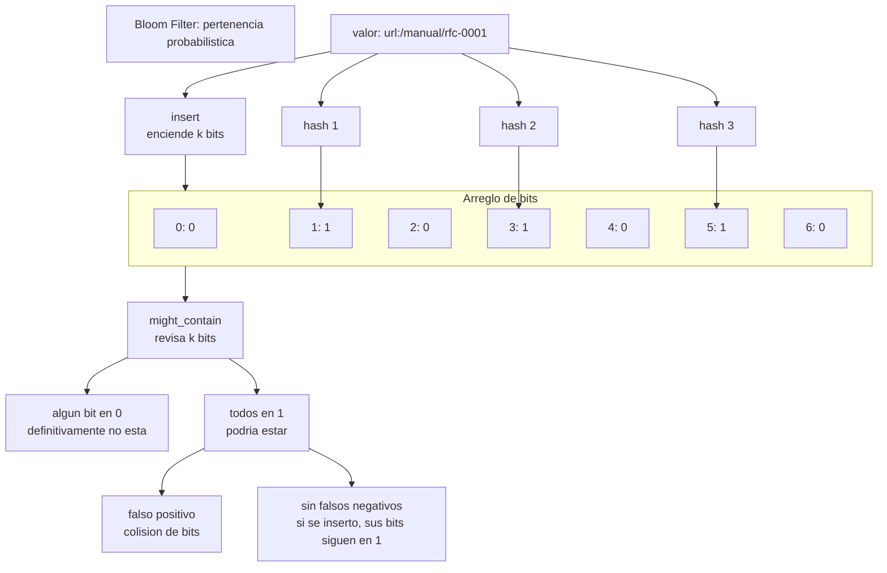

# Bloom Filter

> **Curso:** rust-data-structures · **Capitulo:** 11 · **Prerequisitos:** HashMap, hashing, probabilidad basica y arreglos de bits
> **Codigo:** [`src/bloom_filter.rs`](../src/bloom_filter.rs) · **Video:** pendiente
> **Leccion en el sitio:** pendiente

## Introduccion

Un Bloom Filter responde una pregunta deliberadamente limitada: "este valor
podria estar en el conjunto?". Si responde `false`, el valor definitivamente no
esta. Si responde `true`, el valor podria estar, pero existe la posibilidad de
un falso positivo.

Esa asimetria es la idea central del capitulo. El filtro acepta perder certeza
positiva para ganar espacio. No guarda los elementos completos, no puede listar
valores y no puede borrar sin una variante especial. A cambio, permite filtrar
consultas negativas con muy poca memoria.

En este capitulo implementamos un Bloom Filter educativo con arreglo de bits,
multiples posiciones hash simuladas por double hashing, dimensionamiento por
elementos esperados y estimacion de tasa de falso positivo.

## Motivacion

Imagina una cache delante de una base de datos. Consultar la cache es barato,
pero consultar la base de datos para claves que nunca existieron puede ser caro.
Un Bloom Filter permite decir: "esta clave definitivamente no esta; evita la
lectura". Cuando el filtro responde "podria estar", el sistema hace la lectura
real y confirma.

Tambien aparece en crawlers que quieren evitar repetir URLs, motores de storage
que descartan lecturas de disco cuando una clave no esta en un segmento, y
sistemas distribuidos que necesitan resumir conjuntos sin transportar todos sus
elementos.

La ganancia no es magia: se compra con falsos positivos. Por eso el diseno de un
Bloom Filter empieza con una pregunta de ingenieria: cuanta memoria puedo gastar
y que tasa de error acepto?

## Teoria

### Historia

Burton H. Bloom publico la estructura en 1970 para resolver un problema de
almacenamiento: representar pertenencia con menos memoria que guardar el conjunto
completo. La idea sigue vigente porque muchos sistemas modernos siguen pagando
por I/O, red y memoria antes que por unas cuantas funciones hash.

### Fundamentos

Un Bloom Filter contiene:

- un arreglo de `m` bits, inicialmente en `0`;
- `k` funciones hash o `k` indices derivados por hashing;
- una operacion de insercion;
- una operacion de consulta probabilistica.

Insertar un valor:

```text
hash_1(value) -> posicion a
hash_2(value) -> posicion b
hash_3(value) -> posicion c

bits[a] = 1
bits[b] = 1
bits[c] = 1
```

Consultar un valor revisa esas mismas posiciones:

- si algun bit esta en `0`, el valor definitivamente no fue insertado;
- si todos estan en `1`, el valor podria haber sido insertado.

La segunda respuesta no es exacta porque otros valores pudieron encender los
mismos bits. Esa colision agregada produce falsos positivos.

### Invariantes

Esta implementacion mantiene estas reglas:

- `bit_count > 0`;
- `hash_count > 0`;
- insertar solo cambia bits de `false` a `true`;
- un valor insertado no debe reportarse como definitivamente ausente mientras no
  se llame `clear`;
- `clear` apaga todos los bits y reinicia el contador educativo;
- el contador `inserted_count` mide inserciones realizadas, no valores unicos.

Un Bloom Filter clasico no soporta borrado porque apagar un bit podria romper
otros valores que comparten esa posicion. Para borrar se necesita otra estructura,
como un Counting Bloom Filter.

### Multiples hashes

La implementacion usa double hashing: calcula dos hashes base y deriva los `k`
indices con:

```text
index_i = (hash_a + i * hash_b) % bit_count
```

Esto permite explicar multiples posiciones sin agregar dependencias externas ni
exigir `k` funciones hash distintas. Es suficiente para el objetivo educativo de
este curso.

### Dimensionamiento

Si esperas `n` elementos y quieres una tasa objetivo `p`, las formulas clasicas
son:

```text
m = -(n * ln(p)) / (ln(2)^2)
k = (m / n) * ln(2)
```

Donde:

- `m` es el numero de bits;
- `k` es el numero de hashes;
- `n` es el numero esperado de inserciones;
- `p` es la probabilidad objetivo de falso positivo.

El metodo `with_estimated_items` redondea hacia arriba para no quedarse por
debajo del presupuesto calculado.

### Casos de uso

Usos reales:

- filtro delante de cache o base de datos;
- resumen de claves por segmento en motores de storage;
- web crawlers que evitan revisitar URLs;
- deduplicacion aproximada de eventos;
- sincronizacion preliminar de conjuntos en sistemas distribuidos.

El patron se repite: primero se usa el Bloom Filter para descartar negativos
baratos; despues otra fuente exacta confirma los positivos.

### Ventajas y limitaciones

Ventajas:

- usa mucha menos memoria que guardar todos los elementos;
- insercion y consulta son O(k);
- nunca produce falsos negativos si solo insertas y consultas;
- se puede dimensionar antes de usarlo.

Limitaciones:

- puede producir falsos positivos;
- no guarda valores ni permite iterar;
- no puede borrar de forma segura en su forma clasica;
- la tasa de error empeora si insertas mas elementos que los esperados;
- depende de una distribucion hash razonable.

## Comparacion con alternativas

Un `HashMap` o `HashSet` responde pertenencia exacta, permite recuperar valores y
puede borrar, pero guarda las claves completas. Un Bloom Filter solo guarda bits
y acepta falsos positivos.

Un Counting Bloom Filter reemplaza bits por contadores. Permite borrar cuando el
conteo baja, pero usa mas memoria y debe cuidar overflow de contadores.

Un Cuckoo Filter tambien representa pertenencia aproximada, suele permitir borrado
y puede tener mejor comportamiento para ciertos parametros, pero su
representacion e insercion son mas complejas.

La eleccion depende de la pregunta:

- pertenencia exacta y datos recuperables: `HashSet` o `HashMap`;
- negativos baratos con memoria pequena: Bloom Filter;
- pertenencia aproximada con borrado: Counting Bloom Filter o Cuckoo Filter;
- orden o rangos: B-tree o skip list.

## Diagramas

El diagrama principal vive en [`diagrams/11-bloom-filter.mmd`](../diagrams/11-bloom-filter.mmd).



## Analisis de complejidad

Sea `m` el numero de bits, `k` el numero de hashes y `n` el numero de inserciones.

| Operacion | Mejor caso | Caso promedio | Peor caso | Espacio |
|-----------|------------|---------------|-----------|---------|
| `new` | O(m) | O(m) | O(m) | O(m) |
| `with_estimated_items` | O(m) | O(m) | O(m) | O(m) |
| `insert` | O(k) | O(k) | O(k) | O(k) temporal |
| `might_contain` | O(k) | O(k) | O(k) | O(k) temporal |
| `clear` | O(m) | O(m) | O(m) | O(1) |
| `set_bit_count` | O(m) | O(m) | O(m) | O(1) |
| `estimated_false_positive_rate` | O(1) | O(1) | O(1) | O(1) |

La implementacion actual materializa los indices en un `Vec<usize>` antes de
usarlos. Eso hace visible el concepto para el estudiante; una version productiva
podria iterar los indices sin asignacion temporal.

## Visualizacion interactiva (opcional)

Aplica mas adelante: una visualizacion deberia mostrar como cada hash enciende un
bit, como crece la saturacion del arreglo y por que un falso positivo aparece
cuando varios valores comparten posiciones.

## Implementacion

La implementacion vive en [`src/bloom_filter.rs`](../src/bloom_filter.rs).

El tipo publico guarda el arreglo de bits, el numero de hashes y un contador
educativo:

```rust
pub struct BloomFilter {
    bits: Vec<bool>,
    hash_count: usize,
    inserted_count: usize,
}
```

La API principal es:

- `new(bit_count, hash_count)`;
- `with_estimated_items(expected_items, false_positive_rate)`;
- `insert(value)`;
- `might_contain(value)`;
- `clear()`;
- metodos de observacion para bits, hashes, inserciones y tasa estimada.

Los errores de construccion viven en `BloomFilterError` y evitan filtros sin bits,
sin hashes, sin elementos esperados o con tasa objetivo fuera de `(0, 1)`.

## Pruebas

Las pruebas viven en [`tests/bloom_filter_test.rs`](../tests/bloom_filter_test.rs)
y dentro de [`src/bloom_filter.rs`](../src/bloom_filter.rs).

Cubren:

- valores insertados nunca reportados como ausentes;
- valores controlados que quedan definitivamente ausentes;
- validacion de parametros;
- dimensionamiento recomendado por elementos esperados y tasa objetivo;
- medicion controlada de falsos positivos;
- `clear` apagando bits y reiniciando conteo;
- estimacion inicial de falso positivo en cero;
- relacion entre insercion y cantidad maxima de bits encendidos.

Los doc-comments se validan con `cargo test --doc`.

## Benchmarks

El benchmark vive en [`benches/bloom_filter_bench.rs`](../benches/bloom_filter_bench.rs)
y se ejecuta con:

```bash
cargo bench --bench bloom_filter_bench
```

Mide:

- insercion en Bloom Filter;
- consultas positivas;
- consultas negativas;
- pertenencia exacta equivalente con `std::collections::HashSet`.

El benchmark no intenta demostrar que Bloom Filter siempre sea mas rapido que un
set exacto. Su punto es conectar costo O(k), memoria resumida y filtro de
negativos.

## Ejercicios

### Ejercicio 1: Guardia de cache `[Nivel 1]`

Crea un Bloom Filter con capacidad estimada para 100 claves. Inserta tres claves
de cache y comprueba que una clave insertada podria estar.

**Entrada/Salida esperada:** `"user:1"` devuelve `true` con `might_contain`.

<details>
<summary>Pista</summary>
Usa `with_estimated_items(100, 0.01)` y guarda strings pequenos.
</details>

### Ejercicio 2: Estimar tamano `[Nivel 2]`

Calcula un filtro para 10 000 elementos y 1% de falso positivo. Imprime bits y
hashes calculados.

**Entrada/Salida esperada:** el filtro usa alrededor de 95 000 bits y varios
hashes.

<details>
<summary>Pista</summary>
El metodo redondea hacia arriba, asi que compara con umbrales minimos.
</details>

### Ejercicio 3: Medir falsos positivos `[Nivel 3]`

Inserta 500 claves con prefijo `"url:"`. Consulta otras 500 claves ausentes y
cuenta cuantas aparecen como posibles.

**Entrada/Salida esperada:** el conteo debe mantenerse por debajo de un umbral
razonable para la tasa configurada.

<details>
<summary>Pista</summary>
No esperes cero falsos positivos; ese seria un test incorrecto para esta
estructura.
</details>

### Ejercicio 4: Borrado aproximado `[Nivel 4]`

Disena como cambiarias el filtro para permitir borrado con contadores. Explica
que nuevos errores aparecen.

**Entrada/Salida esperada:** no hay una unica solucion; se evalua claridad sobre
contadores, overflow, decrementos y falsos negativos accidentales.

<details>
<summary>Pista</summary>
Un Counting Bloom Filter puede borrar, pero solo si sus contadores representan
correctamente todas las inserciones que compartieron cada posicion.
</details>

## Soluciones

Soluciones ejecutables de niveles 1 a 3:

- [`examples/soluciones/bloom_filter_cache_guard.rs`](../examples/soluciones/bloom_filter_cache_guard.rs)
- [`examples/soluciones/bloom_filter_size_estimate.rs`](../examples/soluciones/bloom_filter_size_estimate.rs)
- [`examples/soluciones/bloom_filter_false_positive_probe.rs`](../examples/soluciones/bloom_filter_false_positive_probe.rs)

Discusion para el nivel 4:

Un Counting Bloom Filter reemplaza cada bit por un contador. Insertar incrementa
los `k` contadores y borrar los decrementa. La consulta sigue revisando que todos
los contadores sean mayores que cero. El costo conceptual esta en los nuevos
invariantes: no decrementar por debajo de cero, elegir ancho de contador, manejar
overflow y evitar borrar valores que nunca fueron insertados. Si esos invariantes
fallan, la estructura puede crear falsos negativos, justo lo que el Bloom Filter
clasico evita.

## Conexiones con cursos futuros

Mas adelante, cursos de database internals, caches y distributed systems
reutilizaran Bloom filters para evitar lecturas innecesarias, resumir conjuntos,
filtrar claves por segmento y reducir trafico entre nodos. Aqui solo fijamos
pertenencia probabilistica, falsos positivos y dimensionamiento.

## Referencias

- Burton H. Bloom, "Space/Time Trade-offs in Hash Coding with Allowable Errors",
  *Communications of the ACM*, 1970.
- Thomas H. Cormen, Charles H. Leiserson, Ronald L. Rivest y Clifford Stein,
  *Introduction to Algorithms*, estructuras probabilisticas y hashing.
- Rust Standard Library, `std::hash` y `std::collections::HashSet`.
- RFC-0001 §10 y §14: ubicacion curricular y anatomia de capitulos.
