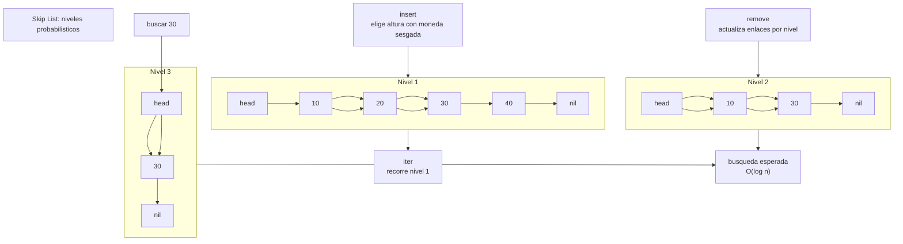

# Skip List

> **Curso:** rust-data-structures · **Capitulo:** 12 · **Prerequisitos:** Linked List, B-Tree, orden total, probabilidad basica y ownership en Rust
> **Codigo:** [`src/skip_list.rs`](../src/skip_list.rs) · **Video:** pendiente
> **Leccion en el sitio:** pendiente

## Introduccion

Una skip list es una estructura ordenada que combina una lista enlazada con
niveles superiores que saltan sobre varios nodos. El nivel inferior contiene
todos los valores en orden. Los niveles superiores contienen subconjuntos de esos
valores y sirven como atajos.

La idea es probabilistica: al insertar, cada nodo recibe una altura aleatoria.
Muchos nodos quedan bajos; pocos llegan alto. Esa distribucion hace que la
busqueda, insercion y remocion sean O(log n) en expectativa, sin rotaciones como
en arboles balanceados.

En este capitulo implementamos una skip list educativa como conjunto ordenado.
Usamos una arena de nodos con indices para evitar `unsafe`, mantener enlaces por
nivel y hacer visible la representacion.

## Motivacion

Un vector ordenado busca rapido, pero insertar en medio cuesta mover elementos.
Una lista enlazada inserta barato una vez encontrada la posicion, pero buscar es
lineal. Un B-tree mantiene orden y escala bien, pero sus divisiones y reglas de
capacidad agregan maquinaria.

La skip list explora otra ruta: conservar una lista ordenada y agregar atajos
probabilisticos. En vez de mantener balance perfecto, acepta balance esperado.
Eso la vuelve atractiva para indices ordenados en memoria, estructuras
concurrent-friendly y sistemas donde una politica probabilistica simple es mas
facil de razonar que un arbol con muchos casos.

## Teoria

### Historia

William Pugh presento las skip lists en 1990 como alternativa probabilistica a
arboles balanceados. Su propuesta era pragmatica: obtener tiempos esperados
logaritmicos con una implementacion mas simple que muchas familias de arboles.

### Fundamentos

Una skip list tiene varios niveles:

```text
nivel 3: head ----------------------> 30
nivel 2: head --------> 10 --------> 30
nivel 1: head -> 10 -> 20 -> 30 -> 40
```

Buscar `30` empieza arriba. Mientras el siguiente valor sea menor que el objetivo,
avanza. Cuando el siguiente valor seria demasiado grande, baja un nivel. La
busqueda termina en el nivel inferior.

Insertar necesita dos pasos:

1. encontrar el camino de predecesores por nivel;
2. elegir una altura y actualizar los enlaces de esos niveles.

Remover usa el mismo camino de predecesores y salta sobre el nodo removido en
cada nivel donde aparece.

### Randomizacion

La altura de cada nodo se elige con una moneda sesgada. Con probabilidad `p`, el
nodo sube al siguiente nivel; si vuelve a salir favorable, sube otra vez, hasta
el nivel maximo.

Con `p = 0.5`, aproximadamente:

- la mitad de los nodos tienen altura al menos 2;
- un cuarto tiene altura al menos 3;
- un octavo tiene altura al menos 4.

Esa forma geometrica da pocos nodos altos y muchos nodos bajos. Los nodos altos
son los atajos.

La implementacion usa un generador lineal congruencial interno con semilla para
que tests, ejemplos y visualizaciones sean reproducibles sin dependencia externa.

### Invariantes

Esta implementacion mantiene estas reglas:

- el nodo `head` existe siempre y tiene `max_level` enlaces;
- `current_level` nunca baja de 1;
- cada nivel esta ordenado de forma ascendente;
- todo nodo enlazado tiene valor;
- el nivel 1 contiene todos los valores vivos;
- insertar duplicados devuelve `false` y no modifica `len`;
- remover un valor desenlaza ese nodo de todos sus niveles;
- `clear` conserva la configuracion y reinicia valores y niveles.

Los nodos removidos quedan en la arena con `value = None`, pero ya no estan
alcanzables desde `head`. Esto evita `unsafe` y mantiene simple el capitulo.

### Casos de uso

Usos comunes:

- indices ordenados en memoria;
- colas por timestamp o prioridad ordenada;
- estructuras base para mapas ordenados concurrent-friendly;
- motores de storage que usan niveles ordenados en memoria;
- busqueda ordenada con inserciones frecuentes.

Este curso implementa un conjunto, no un mapa clave-valor. El mismo modelo puede
extenderse a pares `(K, V)` cuando el valor asociado sea necesario.

### Ventajas y limitaciones

Ventajas:

- busqueda, insercion y remocion esperadas O(log n);
- iteracion ordenada simple por el nivel inferior;
- no requiere rotaciones;
- se puede hacer reproducible con semilla;
- permite explicar probabilidad aplicada a estructuras.

Limitaciones:

- no garantiza O(log n) en el peor caso;
- usa memoria extra por enlaces de niveles;
- el rendimiento depende de la distribucion de alturas;
- una implementacion productiva debe cuidar reclamacion de memoria y concurrencia;
- puede ser menos cache-friendly que un B-tree o un vector.

## Comparacion con alternativas

Un B-tree mantiene orden con nodos multiway y tiene buen comportamiento de
localidad; suele ser mejor cuando importan paginas, cache o disco. La skip list
mantiene orden con atajos probabilisticos y suele ser mas simple de modificar.

Un arbol balanceado garantiza altura logaritmica con rotaciones. La skip list
ofrece altura esperada logaritmica con randomizacion.

Un vector ordenado busca en O(log n), pero insertar o borrar en medio cuesta O(n).
Una lista enlazada inserta barato si ya tienes la posicion, pero buscar cuesta
O(n). La skip list agrega niveles para acelerar esa busqueda.

La eleccion depende del acceso dominante:

- indices ordenados con localidad fuerte: B-tree;
- garantias estrictas de peor caso: arbol balanceado;
- orden con implementacion probabilistica simple: skip list;
- datos pequenos y muy cache-friendly: vector ordenado;
- busqueda exacta sin orden: hashmap.

## Diagramas

El diagrama principal vive en [`diagrams/12-skip-list.mmd`](../diagrams/12-skip-list.mmd).



## Analisis de complejidad

Sea `n` el numero de valores, `h` el nivel actual y `L` el nivel maximo.

| Operacion | Mejor caso | Caso esperado | Peor caso | Espacio |
|-----------|------------|---------------|-----------|---------|
| `new` | O(L) | O(L) | O(L) | O(L) |
| `with_seed` | O(L) | O(L) | O(L) | O(L) |
| `insert` | O(1) | O(log n) | O(n + L) | O(L) temporal |
| `contains` | O(1) | O(log n) | O(n + L) | O(L) temporal |
| `remove` | O(1) | O(log n) | O(n + L) | O(L) temporal |
| `iter` | O(1) crear, O(n) consumir | O(n) | O(n) | O(1) |
| `clear` | O(n) | O(n) | O(n) | O(L) final |
| `level_histogram` | O(n) | O(n) | O(n) | O(L) |

El peor caso aparece si los niveles quedan mal distribuidos. La promesa de la
skip list es esperada, no absoluta.

## Visualizacion interactiva (opcional)

Aplica mas adelante. Una visualizacion deberia mostrar busqueda desde el nivel
superior, descenso por niveles, insercion con altura generada y cambios en el
histograma de niveles.

## Implementacion

La implementacion vive en [`src/skip_list.rs`](../src/skip_list.rs).

El tipo publico guarda una arena de nodos:

```rust
pub struct SkipList<T> {
    nodes: Vec<Node<T>>,
    max_level: usize,
    probability: f64,
    current_level: usize,
    len: usize,
    rng_state: u64,
}
```

Cada nodo guarda un valor opcional y enlaces hacia adelante:

```rust
struct Node<T> {
    value: Option<T>,
    forward: Vec<Option<usize>>,
}
```

El nodo `head` esta en `nodes[0]`. Los enlaces guardan indices dentro de la
arena. Esta decision evita `unsafe` y hace explicito que un enlace es "el indice
del siguiente nodo en este nivel".

La API principal es:

- `new()`;
- `with_seed(max_level, probability, seed)`;
- `insert(value)`;
- `contains(value)`;
- `remove(value)`;
- `iter()`;
- `level_histogram()`;
- metodos de observacion para longitud, nivel actual y nivel maximo.

## Pruebas

Las pruebas viven en [`tests/skip_list_test.rs`](../tests/skip_list_test.rs) y
dentro de [`src/skip_list.rs`](../src/skip_list.rs).

Cubren:

- insercion, busqueda, longitud y vacio;
- iteracion ordenada;
- politica de duplicados;
- remocion sin romper el orden;
- generacion de niveles reproducible con semilla;
- `clear` reiniciando valores y nivel actual;
- validacion de configuracion;
- nivel inicial en listas vacias;
- contraccion de `current_level` al remover el ultimo nodo alto.

Los doc-comments se validan con `cargo test --doc`.

## Benchmarks

El benchmark vive en [`benches/skip_list_bench.rs`](../benches/skip_list_bench.rs)
y se ejecuta con:

```bash
cargo bench --bench skip_list_bench
```

Mide:

- insercion ordenada;
- insercion permutada;
- busqueda;
- iteracion;
- busqueda equivalente con `std::collections::BTreeSet`.

El objetivo es observar el costo esperado de los saltos, no convertir el ejemplo
educativo en una competencia contra la biblioteca estandar.

## Ejercicios

### Ejercicio 1: Trazar niveles `[Nivel 1]`

Crea una skip list con semilla fija, inserta 16 valores y muestra el histograma
de alturas.

**Entrada/Salida esperada:** la suma del histograma coincide con `len()`.

<details>
<summary>Pista</summary>
Usa `with_seed(8, 0.5, 2026)` para obtener una distribucion reproducible.
</details>

### Ejercicio 2: Indice ordenado `[Nivel 2]`

Guarda offsets de archivo o posiciones de documento en una skip list. Inserta
valores fuera de orden y verifica que la iteracion los devuelva ordenados.

**Entrada/Salida esperada:** `[400, 100, 300, 200]` itera como
`[100, 200, 300, 400]`.

<details>
<summary>Pista</summary>
La skip list modela un conjunto; insertar un offset duplicado no aumenta `len`.
</details>

### Ejercicio 3: Ventana expirable `[Nivel 3]`

Modela timestamps ordenados. Extrae los valores menores o iguales a un umbral y
remuevelos de la estructura.

**Entrada/Salida esperada:** al remover `<= 30`, quedan `[40, 50]`.

<details>
<summary>Pista</summary>
Primero recolecta los timestamps a remover en un `Vec`; despues borralos para no
modificar mientras iteras.
</details>

### Ejercicio 4: Mapa ordenado `[Nivel 4]`

Disena como cambiarias `SkipList<T>` para convertirla en `SkipMap<K, V>`.
Describe que cambia en insercion, busqueda, duplicados e iteracion.

**Entrada/Salida esperada:** no hay una unica solucion; se evalua claridad sobre
comparar por clave y almacenar valor asociado.

<details>
<summary>Pista</summary>
El nodo puede guardar `key: K` y `value: V`, pero los enlaces y el camino de
busqueda siguen dependiendo solo de `K`.
</details>

## Soluciones

Soluciones ejecutables de niveles 1 a 3:

- [`examples/soluciones/skip_list_trace_levels.rs`](../examples/soluciones/skip_list_trace_levels.rs)
- [`examples/soluciones/skip_list_ordered_index.rs`](../examples/soluciones/skip_list_ordered_index.rs)
- [`examples/soluciones/skip_list_expiring_window.rs`](../examples/soluciones/skip_list_expiring_window.rs)

Discusion para el nivel 4:

Un `SkipMap<K, V>` separaria clave y valor. Los enlaces, comparaciones y caminos
de predecesores seguirian usando `K: Ord`; el valor podria reemplazarse cuando la
clave ya existe, igual que en un mapa. `insert` podria devolver `Option<V>` con
el valor anterior. `get` y `get_mut` devolverian referencias al valor, mientras
que `iter` podria producir `(&K, &V)` en orden ascendente. La parte delicada no
es el orden, sino mantener ownership claro al reemplazar o remover valores.

## Conexiones con cursos futuros

Mas adelante, cursos de database internals, caches y distributed systems
reutilizaran skip lists para indices ordenados en memoria, estructuras
concurrent-friendly, ventanas por timestamp y niveles de almacenamiento. Aqui
solo fijamos niveles probabilisticos, busqueda esperada e invariantes.

## Referencias

- William Pugh, "Skip Lists: A Probabilistic Alternative to Balanced Trees",
  1990.
- Thomas H. Cormen, Charles H. Leiserson, Ronald L. Rivest y Clifford Stein,
  *Introduction to Algorithms*, estructuras ordenadas.
- Rust Standard Library, `std::collections::BTreeSet`.
- RFC-0001 §10 y §14: ubicacion curricular y anatomia de capitulos.
